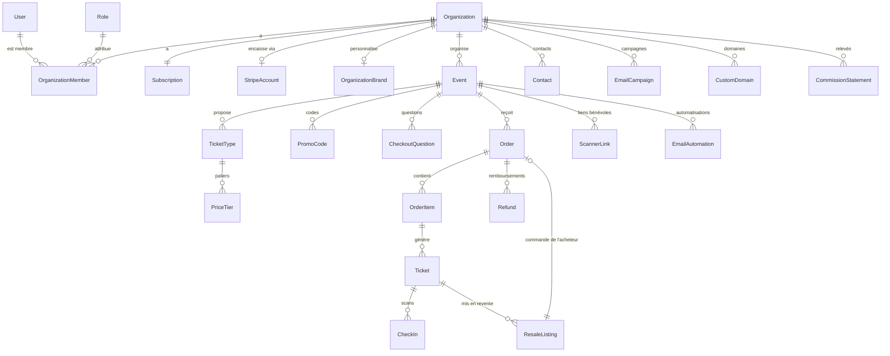

# Evoly — Cahier des charges v2

> Document de référence pour la reconstruction de l'app organisateurs, de la billetterie publique et du scanner.
> Toute décision d'implémentation doit être cohérente avec ce document. Toute évolution doit y être reportée.
> Remplace `CDC Evenly.md` (v1). Le schéma de données correspondant est `packages/db/prisma/schema.prisma`.

| | |
|---|---|
| Version | 2.0 |
| Date | 28 septembre 2026 |
| Éditeur | Evoly Solutions |
| Statut | À valider (voir section 17, décisions ouvertes) |

---

## Sommaire

1. [Objet du document et conventions](#1-objet-du-document-et-conventions)
2. [Vision et positionnement](#2-vision-et-positionnement)
3. [Modèle économique](#3-modèle-économique)
4. [Offres et fonctionnalités](#4-offres-et-fonctionnalités)
5. [Périmètre et priorités](#5-périmètre-et-priorités)
6. [Architecture technique](#6-architecture-technique)
7. [Exigences transversales](#7-exigences-transversales)
8. [Modèle de données](#8-modèle-de-données)
9. [Parcours et fonctionnalités](#9-parcours-et-fonctionnalités)
10. [Catalogue des e-mails](#10-catalogue-des-e-mails)
11. [Tâches planifiées](#11-tâches-planifiées)
12. [Webhooks Stripe](#12-webhooks-stripe)
13. [Sécurité](#13-sécurité)
14. [Qualité et tests](#14-qualité-et-tests)
15. [Reprise de la v1](#15-reprise-de-la-v1)
16. [Plan de réalisation](#16-plan-de-réalisation)
17. [Décisions à valider](#17-décisions-à-valider)
- [Annexe A — Glossaire](#annexe-a--glossaire)
- [Annexe B — Rôles système et permissions](#annexe-b--rôles-système-et-permissions)
- [Annexe C — Calculs de référence](#annexe-c--calculs-de-référence)
- [Annexe D — Liens et textes de référence](#annexe-d--liens-et-textes-de-référence)
- [Annexe E — Sort des fonctionnalités de la v1](#annexe-e--sort-des-fonctionnalités-de-la-v1)

---

## 1. Objet du document et conventions

### 1.1 Objet

Ce cahier des charges décrit l'intégralité du produit Evoly côté organisateurs, participants et contrôle d'accès : fonctionnalités, règles de gestion, modèle économique, architecture, données, sécurité et qualité. Il sert de base au développement de la nouvelle app, qui repart du monorepo existant sans en reprendre l'interface ni les parcours d'argent (voir section 15).

### 1.2 Ce qui change par rapport à la v1

| Sujet | v1 | v2 |
|---|---|---|
| Commission | 5 % (Free) ou 2,5 % (Pro) au-delà d'un quota mensuel de billets offerts | 0,15 € + 1,5 % par billet payant, plafonnée à 1 € (Free) ou 0,70 € (Pro), sans quota |
| Frais bancaires | Payés par Evoly (charges de destination) | Payés par l'organisateur, au coût réel, prélevés directement par Stripe |
| Qui paie | Commission affichée à l'acheteur | Tout est inclus dans le prix du billet : l'acheteur paie le prix affiché |
| Argent des organisateurs | Solde interne, réserve de 20 %, virements manuels | Aucun solde interne : Stripe verse directement l'organisateur |
| Revente | Argent versé à l'organisateur, vendeur non remboursé, prix jusqu'à 2 fois le prix d'origine | Nouvelle commande pour l'acheteur, vendeur remboursé, prix plafonné au prix payé |
| Prix dynamiques | Absents | Paliers automatiques par date ou par quantité (Pro) |
| Membres et rôles | Toutes offres | Pro |
| International | Français et euros codés en dur | Langues et devises dès la conception |
| Design | Aucun design system | Design system repris de la charte Evoly |
| Slogan | « La billetterie honnête » | « Ton prochain souvenir t'attend » |

### 1.3 Conventions

- **Priorités** : **P0** = indispensable au lancement ; **P1** = dans les mois qui suivent le lancement ; **P2** = plus tard.
- **Règles de gestion** : numérotées `RG-DOMAINE-NN` (exemple : `RG-PAY-03`). Elles sont normatives.
- **User stories** : `US-DOMAINE-NN`, au format « En tant que…, je peux… ».
- **⚠** signale une décision encore à valider. La liste complète est en section 17. En attendant, la valeur indiquée est celle à implémenter.
- **Vocabulaire** : organisateur (client d'Evoly), participant ou acheteur (achète des billets), tarif (type de billet), palier (prix dynamique d'un tarif), commande, billet, revente, commission (part d'Evoly), frais bancaires (part de Stripe).
- **Montants** : sauf mention contraire, exprimés en euros, prix tout compris pour l'acheteur.

---

## 2. Vision et positionnement

### 2.1 Le produit

Evoly est une billetterie en ligne en libre-service. Un organisateur crée son événement en une minute, le vend sur sa propre page, encaisse sur son propre compte Stripe et contrôle les entrées avec un téléphone. Les participants achètent en un tap, avec Apple Pay, Google Pay, leur carte ou le moyen de paiement local de leur pays.

### 2.2 Promesse

- Créer un événement en 60 secondes, sans formation.
- Un achat en un tap pour les participants, au prix affiché, sans frais ajoutés.
- Une commission simple et plafonnée, des frais bancaires au coût réel, affichés à l'organisateur.
- La revente entre participants par un simple lien, sans messages ni négociation.
- Des statistiques en direct, du premier billet vendu au dernier scan.

### 2.3 Identité

- **Slogan** : « Ton prochain souvenir t'attend. » (tutoiement assumé dans le slogan uniquement).
- **Ton** : vouvoiement pour les organisateurs dans toute l'app et le site. Phrases courtes, concrètes, sans jargon.
- **Charte** : voir section 7.2.

### 2.4 Cibles

- Associations, cercles et associations étudiantes, clubs, collectifs, indépendants.
- Salles, lieux de vie nocturne, festivals, PME organisant des événements réguliers.
- **Segment d'entrée** : associations étudiantes et vie nocturne (besoins identiques d'un pays à l'autre, soirées complètes, forte demande de revente, bouche-à-oreille entre villes).

### 2.5 Marchés

Le produit est conçu pour l'Europe puis le reste du monde. Ordre de déploiement commercial indicatif :

1. Socle francophone : Belgique, France, Luxembourg, Suisse romande.
2. Royaume-Uni et Irlande.
3. Pays-Bas et pays nordiques.
4. Allemagne, Espagne, Italie.
5. Amérique du Nord et Australie.

Le détail des conditions par pays (devise, part fixe de la commission, moyens de paiement mis en avant, fiscalité) est traité pays par pays avant chaque ouverture.

### 2.6 Positionnement concurrentiel

- **Référence mondiale** : Eventbrite, seul concurrent en libre-service présent presque partout.
- **Champions locaux** : Weezevent, Billetweb, Yurplan, Shotgun, HelloAsso (France et Belgique), Ticket Tailor (Royaume-Uni), Billetto (pays nordiques), Weeztix (Pays-Bas), Luma (événements communautaires).
- Evoly ne cherche pas à être la billetterie la moins chère du marché. Elle vise des frais nettement inférieurs à Eventbrite, inférieurs à la moyenne des concurrents, et un meilleur produit.
- Evoly est « honnête par conception » : prix tout compris affiché dès le départ, frais plafonnés, revente au prix payé, prix dynamiques annoncés à l'avance. La réglementation évolue dans ce sens (affichage du prix total aux États-Unis, interdiction des frais ajoutés en cours d'achat au Royaume-Uni, Digital Fairness Act européen en préparation).

---

## 3. Modèle économique

### 3.1 Offres

| | Free | Pro |
|---|---|---|
| Abonnement | 0 €, sans carte bancaire | 29 € par mois, ou 295,80 € par an (soit 24,65 € par mois, −15 %) |
| Essai | — | 14 jours, carte bancaire requise |
| Billets gratuits | 0 %, sans limite | 0 %, sans limite |
| Commission par billet payant | 0,15 € + 1,5 %, plafonnée à 1 € | 0,15 € + 1,5 %, plafonnée à 0,70 € |
| Frais bancaires | Au coût réel, prélevés par Stripe | Au coût réel, prélevés par Stripe |

Les paramètres sont stockés en base (`Plan`, `PlanCurrencyTerms`) et modifiables sans redéploiement.

⚠ Les prix de l'abonnement sont indiqués toutes taxes comprises. Le traitement de la TVA est à valider (section 17).

### 3.2 Commission Evoly

- **RG-FEE-01** : pour chaque billet payant, commission = arrondi(part fixe + prix payé × taux), plafonnée au plafond de l'offre. Arrondi au centime le plus proche, 0,5 arrondi vers le haut.
- **RG-FEE-02** : le prix payé est le prix effectif du billet pour l'acheteur, après palier et après code promo.
- **RG-FEE-03** : un billet gratuit (prix payé égal à 0) ne génère aucune commission, quel que soit le volume.
- **RG-FEE-04** : l'offre prise en compte est celle de l'organisation au moment où la commande est réservée. Les conditions appliquées sont figées dans la commande (`Order.feeSnapshot`).
- **RG-FEE-05** : la part fixe et le plafond sont définis par devise (`PlanCurrencyTerms`). En euros : part fixe 0,15 €, plafond 1 € (Free) et 0,70 € (Pro), taux 1,5 %.
- **RG-FEE-06** : la commission de la commande est la somme des commissions de ses billets. Elle est prélevée par Stripe comme frais d'application sur le paiement.
- **RG-FEE-07** : il n'existe plus de quota de billets offerts. Aucun compteur mensuel.

Exemples (euros) :

| Prix du billet | Commission Free | Commission Pro |
|---|---|---|
| 1,00 | 0,17 | 0,17 |
| 5,00 | 0,23 | 0,23 |
| 10,00 | 0,30 | 0,30 |
| 20,00 | 0,45 | 0,45 |
| 30,00 | 0,60 | 0,60 |
| 37,00 | 0,71 | 0,70 (plafond atteint dès 36,34 €, commission arrondie) |
| 50,00 | 0,90 | 0,70 |
| 57,00 | 1,00 (plafond atteint dès 56,34 €, commission arrondie) | 0,70 |
| 100,00 | 1,00 | 0,70 |

### 3.3 Frais bancaires

- **RG-FEE-10** : les paiements sont des charges directes sur le compte Stripe de l'organisateur. Stripe y prélève ses frais selon sa propre grille, au coût réel. Evoly ne touche aucune marge sur ces frais.
- **RG-FEE-11** : les frais dépendent du moyen de paiement et du pays du compte Stripe. Repères pour un compte belge (grille Stripe relevée en septembre 2026) : carte européenne standard 1,5 % + 0,25 € ; carte premium 2,8 % + 0,25 € ; carte internationale 3,15 % + 0,25 € et 2 % en cas de conversion ; Bancontact 0,35 € ; iDEAL | Wero 0,29 €.
- **RG-FEE-12** : les frais réels de chaque paiement sont récupérés auprès de Stripe après le paiement et enregistrés (`Order.paymentFeeMinor`) pour les statistiques et les relevés.
- **RG-FEE-13** : le prix payé par l'acheteur est le même quel que soit le moyen de paiement. Aucun surcoût selon le moyen de paiement (interdit dans l'Union européenne pour les cartes des particuliers).

### 3.4 Qui paie

- **RG-FEE-20** : par défaut et sans exception en v2, la commission et les frais bancaires sont inclus dans le prix du billet et déduits des ventes de l'organisateur. L'acheteur paie exactement le prix affiché.
- **RG-FEE-21** : l'organisateur voit, pour chaque tarif, une estimation de ce qu'il touche par billet (prix − commission − frais d'une carte européenne standard) et, dans ses statistiques, les montants réels.
- **RG-FEE-22** : la possibilité de faire payer des frais de service à l'acheteur est hors périmètre v2 (P2). Si elle est ajoutée, le prix affiché dès le premier écran devra inclure ces frais, et leur montant devra être identique quel que soit le moyen de paiement.

Exemple : billet à 30 € payé par carte européenne standard, offre Free. Commission 0,60 € ; frais Stripe 0,70 € ; l'organisateur touche 28,70 €. Payé par Bancontact : frais Stripe 0,35 €, l'organisateur touche 29,05 €.

### 3.5 Abonnement Pro

- **RG-SUB-01** : l'abonnement Pro est vendu par Evoly via Stripe Billing, sur le compte Stripe d'Evoly (pas sur le compte de l'organisateur).
- **RG-SUB-02** : essai de 14 jours avec carte bancaire requise. Sans résiliation avant la fin de l'essai, l'abonnement démarre automatiquement (mensuel ou annuel selon le choix fait au départ).
- **RG-SUB-03** : un e-mail prévient l'organisateur 3 jours avant la fin de l'essai.
- **RG-SUB-04** : résiliation possible à tout moment depuis l'espace de facturation. Elle prend effet à la fin de la période payée, sans remboursement au prorata. L'organisation repasse alors en Free.
- **RG-SUB-05** : passage du mensuel à l'annuel possible à tout moment, avec le crédit au prorata calculé par Stripe.
- **RG-SUB-06** : paiement échoué : nouvelles tentatives automatiques de Stripe, e-mail d'alerte à chaque échec, bandeau dans l'app. Au-delà de 7 jours d'impayé, rétrogradation automatique en Free.
- **RG-SUB-07** : le passage en Pro prend effet immédiatement pour les nouvelles commandes (plafond à 0,70 €). Les commandes déjà réservées gardent leurs conditions.
- **RG-SUB-08** : effets de la rétrogradation en Free (aucune donnée n'est supprimée) :
  - plafond de commission à 1 € pour les nouvelles commandes ;
  - domaines personnalisés désactivés (réactivés sans reconfiguration en cas de retour en Pro) ; sous-domaines d'événement redirigés vers le sous-domaine de l'organisation ;
  - marque masquée (thème Evoly), réglages conservés ;
  - automatisations d'e-mails arrêtées, campagnes programmées annulées avec notification ;
  - ⚠ paliers de prix des événements déjà publiés maintenus jusqu'à la fin de ces événements, sans création ni modification ;
  - ⚠ membres autres que le propriétaire suspendus (ils gardent leur compte mais n'accèdent plus à l'organisation), rôles personnalisés conservés ;
  - ⚠ organisations supplémentaires du même propriétaire passées en lecture seule (voir RG-ORG-04).

### 3.6 Facturation de la commission

- **RG-FEE-30** : chaque mois, un relevé des commissions est généré par organisation et par devise (`CommissionStatement`) : nombre de billets, commissions, commissions remboursées, TVA, total. Il vaut facture et porte un numéro séquentiel.
- **RG-FEE-31** : le relevé est téléchargeable en PDF depuis la page Finances et envoyé par e-mail au propriétaire.
- ⚠ Le traitement de la TVA sur la commission (autoliquidation pour les organisateurs assujettis dans l'Union européenne, TVA belge ou guichet unique OSS pour les autres) est à valider avec l'expert-comptable. La mention appliquée est enregistrée sur chaque relevé.

### 3.7 Remboursements et commission

- **RG-FEE-40** : Evoly conserve toujours sa commission sur les billets remboursés, y compris lors d'une annulation d'événement. Stripe ne restitue pas non plus ses frais de traitement.
- **RG-FEE-41** : cette règle est écrite dans les conditions d'utilisation des organisateurs et rappelée au moment de rembourser.

### 3.8 Revente

- **RG-FEE-50** : chaque revente est un nouveau paiement sur le compte de l'organisateur. Elle génère une commission calculée comme une vente (RG-FEE-01) sur le prix de revente, et ses propres frais bancaires.
- **RG-FEE-51** : ces frais sont supportés par le vendeur : ils sont déduits du montant qui lui est rendu. L'organisateur reste neutre et l'acheteur paie exactement le prix affiché de la revente.
- **RG-FEE-52** : la commission et les frais bancaires de la vente d'origine ne sont pas restitués.

Exemple : billet acheté 30 €, revendu 30 € et payé par carte européenne standard, offre Free. Commission de revente 0,60 € ; frais Stripe 0,70 € ; le vendeur récupère 28,70 € ; l'organisateur n'y gagne ni n'y perd.

### 3.9 Cohérence avec le site

Le simulateur du site compare les frais d'Evoly (commission + frais d'une carte européenne standard, un billet par commande) à la moyenne de 9 billetteries en libre-service. Les constantes du simulateur doivent rester alignées sur `PlanCurrencyTerms`. Toute modification de prix est reportée dans le site le même jour.

---

## 4. Offres et fonctionnalités

| Fonctionnalité | Free | Pro | Priorité |
|---|---|---|---|
| Événements et tarifs illimités | Oui | Oui | P0 |
| Billets gratuits à 0 %, sans limite | Oui | Oui | P0 |
| Commission plafonnée | 1 € | 0,70 € | P0 |
| Frais bancaires au coût réel | Oui | Oui | P0 |
| Paiement Apple Pay, Google Pay, cartes et moyens locaux | Oui | Oui | P0 |
| Page de vente sur `mon-asso.evoly.me` | Oui | Oui | P0 |
| Revente entre participants par lien | Oui | Oui | P0 |
| Section Revente sur la page de vente | Oui | Oui | P0 |
| Statistiques en direct | Oui | Oui | P0 |
| Scanner, liens bénévoles sans compte, mode hors ligne | Oui | Oui | P0 |
| E-mails transactionnels | Oui | Oui | P0 |
| Codes promo | Oui | Oui | P0 |
| Questions à l'achat, billets nominatifs | Oui | Oui | P0 |
| Remboursements et politique par événement | Oui | Oui | P0 |
| Relevés et factures de commission | Oui | Oui | P0 |
| Billets offerts | Oui | Oui | P1 |
| Apple Wallet et Google Wallet | Oui | Oui | P1 |
| Prix dynamiques (paliers par date ou quantité) | — | Oui | P0 |
| Rappels automatiques J-7, J-1, jour J | — | Oui | P0 |
| E-mail après l'événement, campagnes ciblées, statistiques d'ouverture | — | Oui | P0 |
| Couleurs et logo | — | Oui | P0 |
| Aucune mention d'Evoly | — | Oui | P0 |
| Domaine personnalisé avec SSL | — | Oui | P0 |
| Sous-domaine dédié par événement | — | Oui | P1 |
| Membres, rôles système et rôles personnalisés | — | Oui | P0 |
| Plusieurs organisations sur un compte | Une seule | Oui | P0 |
| Plan de salle et placement numéroté | — | Oui | P2 ⚠ |
| Parrainage | Oui | Oui | P2 |
| Espace participant avec compte | Oui | Oui | P2 |

Le contrôle d'accès aux fonctionnalités passe par une fonction unique `hasFeature(organisation, fonctionnalité)` qui lit `Plan.features` et l'état de l'abonnement (voir section 6.4).

---

## 5. Périmètre et priorités

### 5.1 P0 — lancement

- Comptes (e-mail et mot de passe, Google, Apple), vérification d'e-mail, réinitialisation, onboarding.
- Organisations, sous-domaine Evoly, membres et rôles (Pro), plusieurs organisations (Pro).
- Compte Stripe de l'organisateur (onboarding, statuts, lien vers son tableau de bord Stripe).
- Événements : assistant en 3 étapes avec sauvegarde automatique, gestion, publication, annulation, duplication.
- Tarifs, prix dynamiques (Pro), questions à l'achat, billets nominatifs, codes promo.
- Page de vente publique, section Revente, page d'organisation.
- Achat avec réservation temporaire du stock, paiement Stripe (Payment Element), commandes gratuites.
- Confirmation, e-mail avec billets, PDF, lien magique, « retrouver mes billets ».
- Revente par lien et sur la page de vente.
- Remboursements (demande, validation, traitement), annulation d'événement avec remboursements automatiques.
- Scanner (repris de la v1 et corrigé) : liens bénévoles, connexion membre, mode hors ligne, statistiques.
- Statistiques en direct (organisation et événement), exports CSV.
- Finances : ventes, commissions, frais Stripe, net, virements Stripe, relevés mensuels.
- Pro : abonnement, essai, marque, domaine personnalisé, rappels, e-mail après l'événement, campagnes.
- Notifications dans l'app et par e-mail.
- Français et anglais, euros.
- Pages légales, bandeau cookies, conformité RGPD.

### 5.2 P1

- Apple Wallet et Google Wallet.
- Billets offerts par l'organisateur.
- Sous-domaines d'événement (Pro).
- Back-office Evoly.
- Double authentification pour les propriétaires et administrateurs.
- Import de contacts, préférences de notification par membre.
- Annonce du prochain palier de prix sur la page de vente.
- Reçus avec TVA pour les acheteurs professionnels.
- Protection anti-robots sur les ventes à forte demande.
- Néerlandais ; livre sterling et franc suisse.

### 5.3 P2

- Plan de salle et placement numéroté.
- Espace participant avec compte.
- Parrainage.
- Événements récurrents et sessions multiples, liste d'attente.
- Vente sur place (terminal ou Tap to Pay), widget intégrable, API publique et webhooks pour les organisateurs.
- Traductions des contenus d'événement, allemand et espagnol.
- Frais de service facultatifs à la charge de l'acheteur (RG-FEE-22).
- Domaine d'envoi d'e-mails personnalisé.

### 5.4 Hors périmètre

- Prix variables selon la demande en temps réel (« surge pricing »).
- Revente au-dessus du prix payé.
- Place de marché publique d'événements (découverte grand public).
- Conservation de fonds par Evoly pour le compte des organisateurs.

---

## 6. Architecture technique

### 6.1 Vue d'ensemble

```
evoly.me, www.evoly.me          → apps/web      site vitrine (déjà refait)
app.evoly.me                    → apps/app      tableau de bord, billetterie publique, API, webhooks
scanner.evoly.me                → apps/scanner  PWA de contrôle d'accès
[organisation].evoly.me         → apps/app      page de l'organisation et de ses événements
[événement].evoly.me (Pro)      → apps/app      page d'un événement
[domaine personnalisé] (Pro)    → apps/app      page de l'organisation ou d'un événement
evoly.me/e/[code]               → apps/app      lien court global vers un événement
evoly.me/r/[code]               → apps/app      lien de revente
```

### 6.2 Monorepo

```
evoly/
├── apps/
│   ├── web/         site vitrine (statique, déjà livré)
│   ├── app/         nouvelle app (réécrite)
│   └── scanner/     PWA scanner (reprise de la v1, corrigée)
├── packages/
│   ├── db/          schéma Prisma, migrations, client, données de départ
│   ├── core/        logique métier pure : calculs, règles, états
│   ├── ui/          design system (jetons, composants)
│   ├── email/       modèles React Email
│   ├── i18n/        messages traduits, formats
│   └── config/      TypeScript, ESLint, Prettier partagés
└── docs/
    └── CDC.md       ce document
```

### 6.3 Pile technique

| Couche | Choix |
|---|---|
| Framework | Next.js 16 (App Router), React 19, TypeScript en mode strict |
| Base de données | PostgreSQL 16 ou plus, Prisma 7 avec l'adaptateur PostgreSQL |
| Authentification | Better Auth (adaptateur Prisma, sessions en base, limitation des tentatives en base) |
| Paiements | Stripe Connect (comptes des organisateurs), Stripe Billing (abonnement Pro) |
| E-mails | Resend et React Email |
| Fichiers | Cloudflare R2 (images d'événements, logos, PDF) |
| Tâches de fond | File de tâches sur PostgreSQL ⚠ (par exemple pg-boss), déclenchée par un planificateur |
| Styles | Tailwind CSS 4 alimenté par les jetons du design system |
| Traductions | next-intl |
| Validation | Zod |
| Tests | Vitest (logique), Playwright (parcours complets) |
| Suivi d'erreurs | Sentry |
| Hébergement | Serveurs dans l'Union européenne ⚠ (Coolify sur VPS ou équivalent), CDN devant les pages publiques |

### 6.4 Règles d'architecture

- **RG-ARC-01** : `packages/core` n'importe ni Next.js, ni React, ni Prisma. Il contient les calculs (commission, prix effectif, codes promo, remboursements, montants de revente, disponibilité) et les transitions d'états. Il est couvert par des tests unitaires.
- **RG-ARC-02** : l'app n'effectue aucun calcul d'argent en dehors de `packages/core`. Il n'existe qu'une seule implémentation de chaque règle.
- **RG-ARC-03** : chaque action serveur et chaque route d'API suit le même ordre : validation Zod, authentification, autorisation (`can(utilisateur, organisation, permission)`), contrôle de l'offre (`hasFeature`), vérification que la ressource appartient à l'organisation, puis exécution dans une transaction.
- **RG-ARC-04** : les montants, prix et remises ne sont jamais acceptés depuis le navigateur. Ils sont recalculés côté serveur.
- **RG-ARC-05** : tout traitement déclenché par Stripe est idempotent (`StripeWebhookEvent`).
- **RG-ARC-06** : les envois d'e-mails, PDF, statistiques et appels externes non bloquants passent par la file de tâches, avec reprise automatique.
- **RG-ARC-07** : les requêtes sont toujours filtrées par organisation. Aucune route ne retrouve une ressource par un identifiant seul sans vérifier son organisation.

### 6.5 Routage des domaines

- **RG-DOM-01** : le middleware lit l'hôte de la requête et oriente vers la bonne route interne : site, app, scanner, sous-domaine d'organisation, sous-domaine d'événement, domaine personnalisé, redirection d'un ancien sous-domaine (`HostRedirect`, 301 pendant 6 mois). Le proxy d'entrée envoie `evoly.me/e/*` et `evoly.me/r/*` vers `apps/app`, le reste de `evoly.me` restant servi par `apps/web`.
- **RG-DOM-02** : sous-domaines réservés : `app`, `api`, `www`, `scanner`, `admin`, `mail`, `support`, `blog`, `help`, `docs`, `status`, `evoly`, `auth`, `login`, `register`, `static`, `cdn`, `r`, `e`.
- **RG-DOM-03** : les certificats des domaines personnalisés sont émis automatiquement à la demande par le proxy d'entrée, uniquement pour les domaines présents en base et actifs.
- **RG-DOM-04** : chaque hôte qui affiche un paiement (sous-domaines et domaines personnalisés) est déclaré comme domaine de paiement sur le compte Stripe de l'organisateur, pour qu'Apple Pay et Google Pay s'affichent (`StripeAccount.paymentDomains`).
- **RG-DOM-05** : un domaine inconnu ou désactivé affiche une page d'erreur Evoly avec un lien vers l'adresse par défaut de l'organisation.
- **RG-DOM-06** : l'URL canonique d'un événement est celle de son domaine le plus spécifique actif (domaine personnalisé, puis sous-domaine d'événement, puis sous-domaine d'organisation).

### 6.6 Paiements

- **RG-PAY-01** : chaque organisateur a son propre compte Stripe connecté, configuré pour que Stripe lui facture directement ses frais (option « Stripe gère les tarifs »). Evoly ne paie ni les frais de traitement ni les frais Connect de ce compte.
- **RG-PAY-02** : les paiements de billets sont des charges directes sur le compte de l'organisateur, avec la commission Evoly en frais d'application (`application_fee_amount`). L'organisateur est le vendeur des billets.
- **RG-PAY-03** : l'acheteur paie avec le Payment Element de Stripe, moyens de paiement automatiques activés. Les moyens proposés dépendent du pays, de la devise et des réglages du compte de l'organisateur.
- **RG-PAY-04** : les virements vers la banque de l'organisateur sont faits par Stripe selon le calendrier du compte. Evoly affiche le solde et les virements en lecture, sans jamais les déclencher.
- **RG-PAY-05** : remboursements, litiges et contestations sont traités sur le compte de l'organisateur. Evoly en est notifiée et les affiche.
- **RG-PAY-06** : l'abonnement Pro est encaissé sur le compte Stripe d'Evoly (Stripe Billing, portail client).
- **RG-PAY-07** : les webhooks de la plateforme et des comptes connectés sont reçus sur deux points d'entrée signés distincts.

### 6.7 Tâches de fond

La liste complète est en section 11. Principes : planificateur unique, verrou pour éviter les doubles exécutions, journal de chaque exécution, alerte en cas d'échec répété.

### 6.8 Fichiers et images

- Images d'événement et logos stockés sur R2, redimensionnés en plusieurs tailles, servis par le CDN.
- **RG-FILE-01** : formats acceptés JPEG, PNG, WebP, SVG pour les logos (SVG nettoyé de tout script ou converti en PNG). Taille maximale 5 Mo.
- **RG-FILE-02** : les PDF de billets sont générés à la demande et mis en cache, jamais stockés avec un nom devinable.

### 6.9 E-mails

- Envoi via Resend depuis un domaine authentifié (SPF, DKIM, DMARC).
- Expéditeur : « Nom de l'organisation via Evoly » en Free et pour les e-mails système, nom défini dans la marque en Pro. Adresse de réponse : l'e-mail de contact de l'organisation.
- Modèles React Email traduits, avec une version texte.
- Chaque envoi est journalisé (`EmailMessage`) ; les événements de délivrabilité (délivré, ouvert, cliqué, rebond, plainte) sont reçus par webhook.

### 6.10 Temps réel

- **RG-RT-01** : les statistiques en direct se mettent à jour en moins de 5 secondes (flux serveur ou interrogation toutes les 5 secondes).
- **RG-RT-02** : le scanner synchronise ses scans en continu quand il est en ligne et en différé hors ligne.

### 6.11 Environnements et déploiement

- Trois environnements : développement, préproduction (Stripe en mode test), production.
- Migrations appliquées par `prisma migrate deploy` avant le démarrage de chaque version. Jamais de `db push` en production.
- Activation progressive des nouveautés par `FeatureFlag`.
- Sauvegardes chiffrées de la base toutes les 24 heures au minimum, conservées 30 jours ; restauration testée chaque trimestre. Objectifs : perte de données maximale 1 heure (journal de transactions archivé), remise en service en moins de 4 heures.

### 6.12 Observabilité

- Sentry sur les trois apps, avec suppression des données personnelles.
- Journaux structurés, métriques (commandes, paiements, erreurs Stripe, file de tâches, délivrabilité), surveillance de disponibilité des pages publiques et du point d'entrée des webhooks.
- Alertes : taux d'erreur de paiement, webhooks en échec, file de tâches bloquée, certificat en échec.

---

## 7. Exigences transversales

### 7.1 Mobile d'abord

- Toutes les interfaces sont conçues d'abord pour le téléphone. Points de rupture : moins de 768 px, 768 à 1024 px, plus de 1024 px.
- Les tableaux deviennent des listes de cartes sur téléphone. Les panneaux et fenêtres occupent tout l'écran sur téléphone.
- Les actions principales restent atteignables au pouce (barre d'action en bas d'écran sur téléphone).

### 7.2 Design system

Repris de la charte Evoly et du site. Il est implémenté une seule fois dans `packages/ui` et utilisé par l'app, la billetterie publique et le scanner.

- **Couleurs** : charbon `#222222`, crème `#FFF6F0`, lilas `#F3D9F0`, rose pop `#FFB8E8` (accent), graphite `#3D3D3D`, rose bulle `#FBE3F5`. Mode sombre fourni.
- **Typographies** : Archivo Black (titres, minuscules serrées), Archivo 300 et 700 (étiquettes), Yellowtail (un seul mot ou fragment manuscrit par titre), Poppins (textes).
- **Signature** : le O perforé du logo, les formes billet (encoches, perforations), les autocollants (blob, étincelle, spirale).
- **Composants minimum** : boutons, champs, sélecteurs, cases, interrupteurs, curseurs, onglets, étapes, pastilles, étiquettes, cartes, cartes billet, tableaux, listes, fenêtres, panneaux latéraux, notifications éphémères, bandeaux, états vides, squelettes de chargement, graphiques, sélecteur de couleur, import de fichier.
- **Jetons** : couleurs, espacements, rayons, ombres, typographies, durées d'animation, exposés en variables CSS et dans Tailwind.
- **RG-UI-01** : les pages publiques d'un organisateur Pro utilisent ses couleurs et son logo, avec contrôle du contraste (texte blanc ou charbon choisi automatiquement).
- **RG-UI-02** : aucune couleur ni typographie codée en dur hors du design system.

### 7.3 International

- **Langues** : français et anglais au lancement ⚠, néerlandais en P1, allemand et espagnol en P2. Toutes les chaînes passent par `packages/i18n`.
- **Langue affichée** : pour l'organisateur, celle de son compte ; pour l'acheteur, celle de son navigateur si elle est disponible, sinon celle de l'événement. Choix mémorisé.
- **Devises** : euro au lancement ⚠. Le modèle accepte toute devise gérée par Stripe ; la devise d'un événement est celle de l'organisation, figée à la première vente.
- **RG-I18N-01** : les montants sont stockés en unités mineures avec leur devise et formatés selon la langue affichée.
- **RG-I18N-02** : les dates sont stockées en UTC et affichées dans le fuseau de l'événement, avec le fuseau indiqué quand il diffère de celui de l'acheteur.
- **RG-I18N-03** : les e-mails partent dans la langue de l'acheteur (`Order.buyerLocale`).

### 7.4 Accessibilité

- Conformité WCAG 2.2 niveau AA, sur l'app, la billetterie publique et le scanner.
- Navigation complète au clavier, libellés pour tous les éléments interactifs, contrastes AA, animations réduites si demandé par le système.
- Le parcours d'achat est testé avec un lecteur d'écran à chaque version.

### 7.5 Performance

- Pages publiques : premier affichage utile en moins de 2,5 secondes sur un réseau mobile moyen, score Lighthouse Performance d'au moins 90.
- Paiement : moins de 500 ms côté serveur pour créer une réservation, hors appel Stripe.
- Tenue en charge : 2 000 achats en 5 minutes sur un même événement sans survente ni erreur.

### 7.6 Retour haptique

- Sur les actions clés uniquement : paiement confirmé, scan valide, scan refusé, publication. Désactivé si l'utilisateur a demandé moins d'animations.

### 7.7 RGPD

- Données hébergées dans l'Union européenne.
- Evoly est responsable de traitement pour les comptes des organisateurs ; elle agit comme sous-traitant de l'organisateur pour les données des participants. Un accord de sous-traitance est annexé aux conditions d'utilisation.
- Liste des sous-traitants publiée (Stripe, Resend, Cloudflare, hébergeur, Sentry).
- **RG-RGPD-01** : consentement marketing recueilli par une case non cochée lors de l'achat, horodaté, avec sa source (`Contact`).
- **RG-RGPD-02** : droit d'accès, de rectification, d'effacement et d'export traités sous 30 jours. Les données comptables (commandes) sont anonymisées plutôt que supprimées pendant la durée légale de conservation.
- **RG-RGPD-03** : aucune donnée personnelle dans les journaux techniques et les outils de suivi d'erreurs.
- **RG-RGPD-04** : bandeau cookies : seuls les cookies nécessaires sans consentement ; mesure d'audience uniquement après accord.

### 7.8 Conformité commerciale

- **RG-LEG-01** : le prix affiché dès le premier écran est le prix final payé par l'acheteur.
- **RG-LEG-02** : aucun surcoût selon le moyen de paiement.
- **RG-LEG-03** : revente limitée au prix payé pour le billet (interdiction de revendre au-dessus du prix d'origine, notamment en Belgique, en Irlande et bientôt au Royaume-Uni).
- **RG-LEG-04** : les paliers de prix dynamiques sont définis à l'avance ; le prix ne change jamais pendant une réservation.
- **RG-LEG-05** : l'acheteur accepte les conditions de vente de l'organisateur et les conditions d'utilisation d'Evoly avant de payer ; la version acceptée est enregistrée (`Order.termsVersion`). L'organisateur accepte les conditions d'utilisation et l'accord de sous-traitance à la création de l'organisation (`Organization.termsVersion`).
- **RG-LEG-06** : les documents légaux à produire sont listés en section 9.25.

### 7.9 Référencement

- Pages d'événement rendues côté serveur, balises Open Graph et données structurées `Event`, plan du site par organisation, `robots.txt`.
- Événements en brouillon, privés ou non listés : non indexés.

---

## 8. Modèle de données

### 8.1 Principes

- Montants en unités mineures, devises ISO 4217, taux en points de base, dates en UTC.
- Jetons secrets (liens magiques, invitations, réinitialisations) stockés sous forme de hachage.
- Contenu des QR codes aléatoire, d'au moins 128 bits ; code court de 8 caractères pour la saisie manuelle.
- Stripe est la source de vérité pour l'argent ; la base en garde une copie pour l'affichage et les relevés.
- Toute donnée métier est rattachée à une organisation, directement ou via son événement.

### 8.2 Carte des entités principales



### 8.3 Domaines et modèles

| Domaine | Modèles |
|---|---|
| Comptes | `User`, `Account`, `Session`, `Verification`, `RateLimit` |
| Offres et abonnement | `Plan`, `PlanCurrencyTerms`, `Subscription` |
| Organisations | `Organization`, `StripeAccount`, `OrganizationBrand`, `Role`, `OrganizationMember`, `Invitation`, `Venue` |
| Événements | `Event`, `EventTranslation`, `TicketType`, `TicketTypeTranslation`, `PriceTier`, `CheckoutQuestion`, `QuestionAnswer`, `PromoCode` |
| Plan de salle (P2) | `SeatingMap`, `SeatingCategory`, `SeatingRow`, `Seat` |
| Ventes | `Order`, `OrderItem`, `Ticket`, `WalletPass` |
| Revente et remboursements | `ResaleListing`, `Refund`, `RefundItem` |
| Contrôle d'accès | `ScannerLink`, `CheckIn` |
| Finances | `CommissionStatement`, `Dispute`, `StripeWebhookEvent`, `EventDailyStat` |
| Domaines | `CustomDomain`, `HostRedirect` |
| Marketing | `Contact`, `EmailTemplate`, `EmailAutomation`, `EmailCampaign`, `EmailMessage`, `EmailSuppression` |
| Divers | `Notification`, `Referral`, `AuditLog`, `FeatureFlag` |

### 8.4 Cycles de vie

**Événement** (`EventStatus`)

```
DRAFT → PUBLISHED ⇄ SALES_PAUSED
PUBLISHED | SALES_PAUSED → CANCELLED
PUBLISHED | SALES_PAUSED → ENDED (automatique à la fin de l'événement)
ENDED | CANCELLED → ARCHIVED
DRAFT → supprimé (logiquement) si aucune commande
```

**Commande** (`OrderStatus`)

```
PENDING → PAID            paiement confirmé (webhook) ou commande gratuite
PENDING → EXPIRED         réservation expirée
PENDING → FAILED          paiement refusé définitivement
PAID → PARTIALLY_REFUNDED → REFUNDED
PAID → CANCELLED          commande gratuite annulée par l'organisateur
```

**Billet** (`TicketStatus`)

```
VALID → CHECKED_IN
CHECKED_IN → VALID (annulation d'entrée par un responsable, P1)
VALID → VOID (revendu, annulé)
VALID → REFUNDED
```

**Annonce de revente** (`ResaleStatus`)

```
ACTIVE → RESERVED (un acheteur paie) → SOLD
RESERVED → ACTIVE (réservation expirée)
ACTIVE → CANCELLED | EXPIRED
RESERVED → FAILED (remboursement du vendeur impossible, traitement manuel)
```

**Remboursement** (`RefundStatus`)

```
REQUESTED → APPROVED → PROCESSING → SUCCEEDED | FAILED
REQUESTED → REJECTED
(organisateur ou système) → PROCESSING directement
```

**Abonnement** (`SubscriptionStatus`) : `NONE → TRIALING → ACTIVE ⇄ PAST_DUE → CANCELED`, retour à `NONE` (Free) à la fin de la période.

**Domaine personnalisé** (`DomainStatus`) : `PENDING_DNS → ACTIVE ⇄ ERROR`, `ACTIVE → DISABLED` (rétrogradation), `DISABLED → ACTIVE` (retour en Pro).

### 8.5 Contraintes ajoutées en SQL

À écrire dans la première migration, car Prisma ne sait pas les exprimer :

- Une seule annonce de revente `ACTIVE` ou `RESERVED` par billet (index unique partiel).
- Quantités vendues et réservées jamais négatives (`CHECK`) sur `TicketType` et `PriceTier`.
- Prix de revente inférieur ou égal à la valeur faciale (`CHECK`).
- Séquence de numérotation des relevés de commissions, sans trou (`CommissionStatement.number`).

### 8.6 Données de départ

`packages/db/prisma/seed.ts` crée les offres Free et Pro, leurs conditions en euros et les six rôles système (annexe B).

---

## 9. Parcours et fonctionnalités

### 9.1 Comptes et connexion (P0)

**User stories**

- US-AUTH-01 : en tant que visiteur, je peux créer un compte avec mon e-mail et un mot de passe.
- US-AUTH-02 : en tant que visiteur, je peux créer un compte ou me connecter avec Google ou Apple.
- US-AUTH-03 : en tant que nouvel utilisateur inscrit par e-mail, je confirme mon adresse avant d'accéder au tableau de bord.
- US-AUTH-04 : en tant qu'utilisateur, je peux réinitialiser mon mot de passe.
- US-AUTH-05 : en tant qu'utilisateur, je choisis la langue de mon interface.
- US-AUTH-06 (P1) : en tant que propriétaire ou administrateur, j'active la double authentification.

**Routes** : `/login`, `/register` (accepte `?plan=pro` et `?ref=code`), `/verify-email`, `/forgot-password`, `/reset-password`.

**Règles**

- RG-AUTH-01 : e-mails normalisés en minuscules ; un compte par adresse.
- RG-AUTH-02 : mot de passe d'au moins 10 caractères, vérifié contre les mots de passe connus comme compromis ; haché avec Argon2id (stocké dans `Account.password`).
- RG-AUTH-03 : lien de vérification valable 24 heures ; lien de réinitialisation valable 1 heure et utilisable une seule fois. Les identifiants de ces jetons sont stockés hachés (`Verification`).
- RG-AUTH-04 : un compte Google ou Apple est considéré comme vérifié. Si un compte e-mail existe déjà avec la même adresse vérifiée, les deux sont reliés.
- RG-AUTH-05 : 5 tentatives de connexion échouées en 15 minutes bloquent temporairement l'adresse et l'IP (délai progressif).
- RG-AUTH-06 : la réinitialisation ne révèle jamais si une adresse possède un compte.
- RG-AUTH-07 : la session mémorise la dernière organisation ouverte (`Session.activeOrganizationId`).
- RG-AUTH-08 : `?plan=pro` enchaîne sur l'essai Pro après l'onboarding ; `?ref=code` enregistre le parrainage (P2).

### 9.2 Onboarding (P0)

**User stories**

- US-ONB-01 : en tant que nouvel utilisateur, je suis guidé pour créer mon organisation en trois étapes.
- US-ONB-02 : en tant que nouvel utilisateur, je peux reporter la connexion de mon compte Stripe.

**Étapes**

1. **Organisation** : nom (obligatoire), adresse de la page (`[sous-domaine].evoly.me`, générée depuis le nom, modifiable, disponibilité vérifiée en direct), pays (détermine la devise et la langue par défaut), type (particulier, association, entreprise, organisme public).
2. **Encaissement** : bouton « Connecter mon compte Stripe » (onboarding hébergé par Stripe) ou « Plus tard ».
3. **Premier événement** : lancement direct de l'assistant de création (section 9.5), ou accès au tableau de bord.

**Règles**

- RG-ONB-01 : l'utilisateur devient propriétaire (`OWNER`) de l'organisation créée.
- RG-ONB-02 : l'organisation démarre en Free (`Subscription.status = NONE`), ou en essai Pro si l'inscription vient de `?plan=pro`.
- RG-ONB-03 : sans compte Stripe actif, l'organisateur peut créer et publier des événements gratuits, mais ne peut pas publier de tarif payant. Un bandeau le lui rappelle.
- RG-ONB-04 : l'onboarding reprend à l'étape en cours s'il est interrompu.

### 9.3 Organisations, membres et rôles (P0)

**User stories**

- US-ORG-01 : en tant que propriétaire, je modifie les informations de mon organisation.
- US-ORG-02 (Pro) : en tant qu'administrateur, j'invite des membres par e-mail avec un rôle.
- US-ORG-03 (Pro) : en tant qu'administrateur, je crée des rôles personnalisés en cochant des permissions.
- US-ORG-04 (Pro) : en tant qu'utilisateur, j'appartiens à plusieurs organisations et je passe de l'une à l'autre.
- US-ORG-05 : en tant que propriétaire, je transfère la propriété ou je supprime l'organisation.

**Page Paramètres** : nom, raison sociale, description, e-mail de contact (affiché aux participants), téléphone, site, pays, devise (non modifiable après la première vente), langue, fuseau horaire, adresse et numéro de TVA (pour les relevés), adresse de la page.

**Page Membres et rôles (Pro)**

- Onglet Membres : nom, e-mail, rôle, date d'arrivée, statut ; changer le rôle, retirer. Invitations en attente : renvoyer, révoquer.
- Onglet Rôles : rôles système en lecture seule (annexe B) ; rôles personnalisés à créer, modifier, supprimer.

**Règles**

- RG-ORG-01 : une organisation a toujours exactement un propriétaire. Le propriétaire ne peut pas quitter l'organisation sans avoir transféré la propriété.
- RG-ORG-02 : invitation valable 48 heures, à usage unique. Sans compte, l'invité s'inscrit puis rejoint automatiquement ; avec un compte, il accepte depuis une page dédiée. L'adresse du compte doit correspondre à celle de l'invitation.
- RG-ORG-03 : un rôle personnalisé ne peut pas être supprimé tant qu'un membre l'utilise.
- RG-ORG-04 : ⚠ un compte peut posséder une seule organisation en Free. Toute organisation supplémentaire doit être en Pro (essai compris). Si une organisation supplémentaire repasse en Free, elle passe en lecture seule (aucune création ni publication) jusqu'à son retour en Pro. Rejoindre l'organisation d'un tiers comme membre reste possible sans limite.
- RG-ORG-05 : en Free, l'organisation n'a que son propriétaire. Les bénévoles scannent via des liens sans compte (section 9.17).
- RG-ORG-06 : suppression de l'organisation : réservée au propriétaire, double confirmation, impossible tant qu'un événement a des ventes à venir ou qu'un abonnement Pro est actif. Données anonymisées selon la section 7.7.
- RG-ORG-07 : les permissions sont vérifiées côté serveur à chaque action. Les éléments d'interface non autorisés sont masqués, mais le masquage n'est jamais la seule protection.
- RG-ORG-08 : changement d'adresse de page : l'ancien sous-domaine redirige pendant 6 mois (`HostRedirect`), puis il est libéré.

### 9.4 Tableau de bord et statistiques en direct (P0)

**User stories**

- US-STAT-01 : en tant qu'organisateur, je vois mes ventes, ma recette et mon remplissage en temps réel.
- US-STAT-02 : en tant qu'organisateur, je suis le jour J les entrées scannées en direct.
- US-STAT-03 : en tant qu'organisateur, j'exporte mes commandes et mes participants.
- US-STAT-04 (Pro) : en tant que membre, j'accède aux chiffres selon mon rôle.

**Navigation (barre latérale)**

```
[Sélecteur d'organisation]
Accueil
Événements
Commandes
Revente
Contacts et e-mails   (Pro)
Finances
────────────
Membres et rôles      (Pro)
Marque et domaines
Abonnement
Paramètres
────────────
[Compte, langue, déconnexion]
```

**Accueil de l'organisation**

- Indicateurs sur 30 jours glissants, avec variation par rapport aux 30 jours précédents : recette nette, billets vendus, événements en vente, taux de présence moyen.
- Courbe des ventes par jour (bascule recette ou nombre de billets).
- Prochains événements avec leur remplissage.
- Activité récente : ventes, reventes, remboursements, scans (20 dernières entrées, lien « tout voir »).

**Vue d'un événement** (onglet Aperçu, voir 9.5)

- Compteurs en direct : billets vendus sur la jauge, recette brute, commission, frais bancaires, net estimé, par tarif et par palier.
- Reventes (en cours, conclues), remboursements, billets offerts.
- Le jour J : présents sur vendus, taux, répartition par tarif et par entrée, derniers scans.
- Courbe des ventes dans le temps.

**Règles**

- RG-STAT-01 : mise à jour en moins de 5 secondes (RG-RT-01).
- RG-STAT-02 : événements en brouillon exclus des chiffres de l'organisation.
- RG-STAT-03 : le net définitif utilise les frais Stripe réels ; tant qu'ils ne sont pas connus, le net affiché est une estimation signalée comme telle.
- RG-STAT-04 : exports CSV des commandes, des billets et des participants (réponses aux questions comprises), réservés à la permission `CONTACTS_EXPORT`. Chaque export est journalisé.
- RG-STAT-05 : les chiffres respectent les permissions : sans `FINANCE_VIEW`, les montants sont masqués.

### 9.5 Événements (P0)

**User stories**

- US-EVT-01 : en tant qu'organisateur, je crée un événement en moins de 60 secondes.
- US-EVT-02 : en tant qu'organisateur, mon brouillon est sauvegardé automatiquement.
- US-EVT-03 : en tant qu'organisateur, je publie, mets en pause, annule, duplique ou archive un événement.
- US-EVT-04 : en tant qu'organisateur, je prévisualise la page de vente avant de publier.

**Assistant de création**

1. **L'essentiel** : titre, date et heure de début, date et heure de fin (facultatif), fuseau (celui de l'organisation par défaut), image (facultatif), description courte.
2. **Le lieu** : sur place (adresse avec autocomplétion et coordonnées, ou lieu enregistré), en ligne (lien révélé après achat), ou les deux.
3. **Les billets** : un premier tarif prérempli (nom, prix, quantité), puis aperçu et « Publier » ou « Enregistrer le brouillon ».

**Onglets de gestion d'un événement**

| Onglet | Contenu |
|---|---|
| Aperçu | Statut, liens publics (copier, partager, QR code de la page), statistiques en direct, actions |
| Billets | Tarifs, paliers (Pro), jauge, questions à l'achat |
| Codes promo | Liste et création |
| Commandes | Liste, recherche, détail, actions |
| Revente | Annonces en cours et conclues, réglages de revente |
| Entrées | Liens bénévoles, liste de contrôle, statistiques de présence, ouvrir le scanner |
| E-mails (Pro) | Automatisations, campagnes liées à l'événement |
| Page | Description riche, image, FAQ, message de confirmation, couleurs (Pro), sous-domaine (Pro) |
| Réglages | Dates, lieu, visibilité, ventes, remboursements, revente, annulation |

**Réglages d'un événement**

- Visibilité : publique, non listée, privée avec code d'accès.
- Ventes : ouverture et fermeture, nombre maximum de billets par commande, durée de réservation (10 minutes par défaut).
- Remboursements : non remboursable, jusqu'à une date limite, sur demande, toujours remboursable.
- Revente : activée ou non, fin de la revente (2 heures avant le début par défaut), affichage de la section Revente.

**Règles**

- RG-EVT-01 : sauvegarde automatique toutes les secondes d'inactivité, avec indicateur « Enregistré ». Reprise à l'étape en cours.
- RG-EVT-02 : publication impossible sans au moins un tarif actif. Publication d'un tarif payant impossible sans compte Stripe actif.
- RG-EVT-03 : un brouillon n'est jamais accessible publiquement (page 404).
- RG-EVT-04 : événement complet (plus aucun billet disponible) : la page affiche « Complet » et met en avant la section Revente si elle contient des places.
- RG-EVT-05 : changement de date, d'heure ou de lieu d'un événement publié : e-mail automatique aux acheteurs, avec l'ancienne et la nouvelle valeur, et possibilité de demander un remboursement pendant 14 jours ⚠ (motif `EVENT_CHANGED`, à partir de `Event.lastMajorChangeAt`).
- RG-EVT-06 : fin de l'événement (`endsAt`, ou `startsAt` + 6 heures à défaut) : passage automatique en `ENDED`.
- RG-EVT-07 : duplication : copie des textes, du lieu, des tarifs, des paliers, des questions et des réglages, sans commandes, en brouillon, avec des dates à redéfinir.
- RG-EVT-08 : suppression possible uniquement pour un brouillon sans commande. Sinon : archivage.
- RG-EVT-09 : le code court (`publicCode`) est unique pour toute la plateforme ; l'adresse `evoly.me/e/[code]` redirige vers l'URL canonique (RG-DOM-06).
- RG-EVT-10 : deux membres modifient le même événement : la dernière sauvegarde l'emporte, et l'autre membre voit un avertissement « Modifié par [nom] » avec la possibilité de recharger.
- RG-EVT-11 : l'annulation est traitée en section 9.14.

### 9.6 Tarifs et prix dynamiques

**User stories**

- US-TKT-01 (P0) : en tant qu'organisateur, je crée plusieurs tarifs par événement.
- US-TKT-02 (P0) : en tant qu'organisateur, je vois ce que je toucherai par billet.
- US-TKT-03 (P0, Pro) : en tant qu'organisateur, je programme des paliers de prix par date ou par quantité.
- US-TKT-04 (P1, Pro) : en tant qu'acheteur, je vois le prochain palier et sa date.

**Tarif** : nom, description, prix tout compris (0 = gratuit), quantité (vide = illimitée dans la jauge), dates de vente, minimum et maximum par commande, visibilité (visible, masqué, réservé aux codes), nominatif, revente autorisée, taux de TVA de l'organisateur (pour les reçus, P1).

**Palier (Pro)** : nom (« Prévente », « Normal », « Jour J »), prix, période (début, fin) et/ou quota (les N premiers billets), ordre.

**Règles**

- RG-TKT-01 : le prix minimum d'un billet payant est de 1,00 € ⚠ (ou l'équivalent dans la devise).
- RG-TKT-02 : l'écran d'un tarif affiche en direct la commission et les frais bancaires estimés, et le montant touché par billet (RG-FEE-21).
- RG-TKT-03 : disponibilité d'un tarif = min(quantité du tarif − vendus − réservés, jauge de l'événement − vendus − réservés sur tous les tarifs).
- RG-TKT-04 : ordre d'affichage modifiable par glisser-déposer.
- RG-TKT-05 : après la première vente, le prix de base d'un tarif est figé ; la quantité peut être augmentée ou réduite jusqu'au nombre déjà vendu.
- RG-TKT-06 : un tarif avec des ventes ne peut pas être supprimé, seulement masqué ou archivé. Les billets vendus restent valides.
- RG-TKT-07 : prix effectif (Pro) : le premier palier, dans l'ordre, dont la période est en cours et dont le quota n'est pas atteint. Sans palier applicable, le prix de base.
- RG-TKT-08 : le prix effectif est calculé au moment de la réservation et reste garanti pendant toute sa durée (RG-LEG-04).
- RG-TKT-09 : le prix d'un palier ayant déjà des ventes est figé ; ses dates et quotas futurs restent modifiables. Un palier à venir est entièrement modifiable.
- RG-TKT-10 : l'interface signale les trous de calendrier (période sans palier) et les chevauchements.
- RG-TKT-11 : les statistiques détaillent les ventes par palier.

### 9.7 Questions à l'achat et billets nominatifs (P0)

- US-QST-01 : en tant qu'organisateur, j'ajoute des questions au formulaire d'achat (texte, choix, case, nombre, date, téléphone, e-mail), obligatoires ou non, par commande ou par billet, pour tous les tarifs ou certains.
- US-QST-02 : en tant qu'organisateur, je rends un tarif nominatif : chaque billet porte le nom de son titulaire.
- RG-QST-01 : pour un tarif nominatif, l'acheteur renseigne prénom, nom et, si demandé, e-mail de chaque titulaire. Le premier billet peut reprendre ses propres coordonnées en un clic.
- RG-QST-02 : l'acheteur peut modifier le nom d'un titulaire depuis la page de ses billets jusqu'au début de l'événement, sauf si l'organisateur l'a interdit (`Event.allowHolderChange`).
- RG-QST-03 : une question ayant des réponses ne peut pas être supprimée, seulement archivée.

### 9.8 Codes promo (P0)

- US-PRM-01 : en tant qu'organisateur, je crée des codes : pourcentage, montant fixe par billet, ou gratuité.
- Champs : code (saisi ou généré), type, valeur, tarifs concernés, nombre d'utilisations total et par e-mail, dates de validité, déblocage des tarifs réservés aux codes.
- RG-PRM-01 : le code est vérifié uniquement côté serveur : appartenance à l'événement, actif, dates, limites totale et par e-mail, tarifs concernés.
- RG-PRM-02 : la remise s'applique au prix effectif (palier compris). Le prix après remise ne peut pas être négatif.
- RG-PRM-03 : le compteur d'utilisations est incrémenté au paiement, dans la même transaction que la validation de la commande, sans dépasser la limite.
- RG-PRM-04 : un code déjà utilisé ne peut pas être supprimé, seulement désactivé.
- RG-PRM-05 : un code de gratuité rend la commande gratuite : aucun paiement, aucune commission.

### 9.9 Plan de salle (P2, Pro ⚠)

- Catégories (nom, couleur, tarif associé), rangs, sièges (libellés automatiques ou manuels), sièges bloqués, choix du siège par l'acheteur activé ou non (sinon attribution automatique au paiement).
- RG-SEAT-01 : un siège est réservé avec le panier et libéré à l'expiration.
- RG-SEAT-02 : les sièges vendus ne sont plus modifiables ; un rang avec des sièges vendus ne peut pas être supprimé.
- RG-SEAT-03 : une modification du plan pendant la vente prévient les acheteurs concernés.

### 9.10 Page de vente publique (P0)

**User stories**

- US-PUB-01 : en tant qu'acheteur, je trouve toutes les informations sur une seule page.
- US-PUB-02 : en tant qu'acheteur, je choisis mes billets et je paie sans quitter la page.
- US-PUB-03 : en tant qu'acheteur, je n'ai pas besoin de créer de compte.
- US-PUB-04 : en tant qu'acheteur, je vois les places proposées en revente.

**Structure**

```
En-tête : logo de l'organisation (Pro) ou d'Evoly, liens vers l'organisation
Image + titre + date + lieu
[Ordinateur : deux colonnes]         [Téléphone : une colonne]
Colonne principale :                  Bloc Billets en haut, bouton fixe « Voir les billets »
- Date, horaires, fuseau
- Lieu, carte, itinéraire
- Description
- Compte à rebours (à moins de 30 jours)
- FAQ (10 questions maximum)
- Autres événements de l'organisation (3 maximum)
- Partage (copier, WhatsApp, Messenger, X, e-mail)
Colonne d'achat (fixe au défilement) :
- Section Billets : tarifs, prix, disponibilité, quantités
- Section Revente : places revendues, regroupées par tarif
- Champ code promo
- Total et bouton d'achat
Pied de page : organisateur, conditions, « Billetterie propulsée par Evoly » (Free)
```

**Règles**

- RG-PUB-01 : rendu côté serveur, mis en cache quelques secondes, disponibilités et prix actualisés en direct.
- RG-PUB-02 : disponibilité affichée : « Plus que N » sous un seuil (10 % ou 20 places), « Complet » à zéro.
- RG-PUB-03 : les prix affichés sont les prix finaux (RG-LEG-01), sans ligne de frais.
- RG-PUB-04 : la section Revente regroupe les annonces actives par tarif (« Fosse : 2 places à 24 € »), triées par prix puis par ancienneté. Elle est masquée si elle est vide ou désactivée.
- RG-PUB-05 : événement annulé : page dédiée expliquant l'annulation et le remboursement. Événement terminé : page d'archive avec les événements à venir de l'organisation.
- RG-PUB-06 : événement privé : saisie du code d'accès avant affichage.
- RG-PUB-07 : la page de l'organisation (`mon-asso.evoly.me`) liste ses événements publics à venir, puis les événements passés.

### 9.11 Achat et moyens de paiement (P0)

**User stories**

- US-BUY-01 : en tant qu'acheteur, je paie en un tap avec Apple Pay, Google Pay, ma carte ou le moyen local de mon pays.
- US-BUY-02 : en tant qu'acheteur, mes places sont garanties pendant que je paie.

**Déroulé**

1. L'acheteur choisit ses quantités (et son siège en P2) et saisit un éventuel code promo.
2. « Continuer » crée la réservation : commande `PENDING`, quantités réservées, prix figés, compte à rebours de 10 minutes affiché.
3. Formulaire sur la même page : prénom, nom, e-mail (avec détection des fautes courantes de domaine), téléphone si l'organisateur l'exige ⚠ (`Event.requireBuyerPhone`), titulaires des billets nominatifs, questions, case non cochée « Recevoir les actualités de [organisation] », mention d'acceptation des conditions.
4. Paiement dans le Payment Element (moyens automatiques), avec l'intention de paiement créée sur le compte de l'organisateur et la commission en frais d'application.
5. Confirmation affichée dès le retour de Stripe ; la commande passe `PAID` à réception du webhook.

**Règles**

- RG-BUY-01 : la réservation est atomique : elle vérifie et incrémente les quantités réservées du tarif, du palier et de la jauge dans une seule transaction avec condition, pour rendre la survente impossible.
- RG-BUY-02 : à expiration, les quantités sont libérées et la commande passe `EXPIRED` (tâche toutes les minutes, et vérification à chaque lecture). Si un paiement arrive après l'expiration et que les places sont toujours disponibles, la commande est honorée ; sinon, le paiement est remboursé intégralement et l'acheteur est prévenu.
- RG-BUY-03 : les montants, remises et commissions sont calculés côté serveur par `packages/core` (RG-ARC-02, RG-ARC-04).
- RG-BUY-04 : commande gratuite (tous les prix à 0 ou code de gratuité) : aucune intention de paiement, validation immédiate, mêmes contrôles de disponibilité et de code promo.
- RG-BUY-05 : total minimum d'une commande payante : le minimum accepté par Stripe dans la devise.
- RG-BUY-06 : paiement refusé : message clair sur la même page, réservation conservée jusqu'à son expiration, formulaire toujours rempli. Authentification forte (3D Secure) gérée par le Payment Element.
- RG-BUY-07 : validation de la commande à réception de `payment_intent.succeeded`, une seule fois (RG-ARC-05) : statut `PAID`, quantités réservées converties en vendues, billets créés avec leurs codes, contact mis à jour, compteur du code promo incrémenté, frais Stripe réels récupérés, e-mail de confirmation mis en file, notification, statistiques.
- RG-BUY-08 : la page de confirmation interroge l'état de la commande tant que le webhook n'est pas arrivé (« Paiement en cours de confirmation »).
- RG-BUY-09 : nombre maximum de billets par commande (10 par défaut, `Event.maxTicketsPerOrder`) ; limite facultative par adresse e-mail et par événement (P1, `Event.maxTicketsPerBuyer`).
- RG-BUY-10 : limitation du nombre de réservations par IP et par appareil ; protection anti-robots activable sur les événements à forte demande (P1).
- RG-BUY-11 : moyens de paiement mis en avant par pays : Apple Pay et Google Pay partout ; Bancontact (Belgique), iDEAL | Wero (Pays-Bas), Cartes Bancaires (France), TWINT (Suisse), BLIK (Pologne), Swish (Suède), MB WAY (Portugal), Bizum (Espagne) ; PayPal, Klarna et Revolut Pay selon l'activation du compte de l'organisateur. Le guide de connexion Stripe recommande à l'organisateur d'activer les moyens de son pays.

### 9.12 Après l'achat (P0)

**User stories**

- US-POST-01 : en tant qu'acheteur, je reçois mes billets par e-mail et je les retrouve via un lien.
- US-POST-02 : en tant qu'acheteur, je retrouve mes billets avec mon adresse e-mail si j'ai perdu l'e-mail.
- US-POST-03 (P1) : en tant qu'acheteur, j'ajoute mes billets à Apple Wallet ou Google Wallet.

**Page de confirmation** : récapitulatif (événement, date, lieu, billets, total), accès aux billets, ajout au calendrier (fichier ICS), partage, bouton wallet (P1).

**E-mail de confirmation** : récapitulatif, lien magique vers les billets, PDF joint (un fichier pour la commande, une page par billet), fichier ICS, informations pratiques, lien en ligne pour les événements en ligne.

**Page des billets** (lien magique) : un QR code par billet avec son code court et son titulaire, bouton de mise en revente, demande de remboursement (selon la politique), modification des titulaires, téléchargement du PDF, ajout au wallet (P1), informations de l'événement.

**PDF d'un billet** : QR code grand format, code court, événement, date, lieu, tarif, titulaire, référence de commande, siège (P2), logo de l'organisation (Pro) ou d'Evoly.

**Règles**

- RG-POST-01 : le lien magique est un jeton aléatoire dont seul le hachage est stocké. Il ne donne accès qu'à une commande.
- RG-POST-02 : « Retrouver mes billets » : l'acheteur saisit son e-mail et reçoit un nouveau lien pour chacune de ses commandes à venir. Réponse identique que l'adresse existe ou non. Limité à 3 demandes par heure et par adresse.
- RG-POST-03 : un billet désactivé (revendu, remboursé, annulé) affiche son statut à la place du QR code.
- RG-POST-04 (P1) : un pass wallet par billet ; mis à jour si l'événement change ; invalidé si le billet est désactivé.

### 9.13 Revente (P0)

**User stories**

- US-RSL-01 : en tant que participant qui ne peut plus venir, je mets ma place en revente et je partage un lien, sans rien d'autre à faire.
- US-RSL-02 : en tant que participant, je vois les places en revente dans une section dédiée de la page de vente.
- US-RSL-03 : en tant qu'acheteur d'une place en revente, je paie en un tap et je reçois un billet à mon nom.
- US-RSL-04 : en tant que vendeur, je suis remboursé automatiquement dès que ma place est vendue.
- US-RSL-05 : en tant qu'organisateur, je suis les reventes, je les désactive ou je retire une annonce.

**Mise en revente** (depuis la page des billets)

1. Le participant choisit le billet et le prix, proposé par défaut au prix qu'il a payé et jamais au-dessus.
2. Evoly affiche le montant qu'il récupérera (prix moins la commission et les frais bancaires de la revente, RG-FEE-51).
3. Le lien est créé (`evoly.me/r/[code]`), prêt à être copié ou partagé. L'annonce apparaît aussi dans la section Revente de la page de vente.

**Achat d'une place en revente**

1. L'acheteur ouvre le lien ou choisit une place dans la section Revente.
2. L'annonce est réservée 10 minutes (`RESERVED`) ; les autres visiteurs la voient indisponible.
3. L'acheteur paie comme pour un achat classique ; le paiement est une charge directe sur le compte de l'organisateur, avec la commission de revente.
4. À la confirmation du paiement, dans une seule transaction : l'ancien billet passe `VOID` (motif `RESOLD`), une commande `RESALE` est créée pour l'acheteur avec un nouveau billet et un nouveau code, l'annonce passe `SOLD`.
5. Le remboursement partiel du vendeur est envoyé à Stripe sur sa commande d'origine, du montant calculé en 2 de la mise en revente, ajusté avec les frais Stripe réels du paiement de l'acheteur.
6. E-mails : billets à l'acheteur, confirmation et montant remboursé au vendeur. Notification `RESALE_SOLD` à l'organisateur.

**Règles**

- RG-RSL-01 : peuvent être revendus les billets `VALID`, non scannés, d'un tarif autorisant la revente, d'un événement où la revente est activée, avant la fin de la revente (2 heures avant le début par défaut).
- RG-RSL-02 : prix de revente inférieur ou égal au prix payé pour ce billet (`Ticket.faceValueMinor`), contrôlé en base (section 8.5) et côté serveur (RG-LEG-03).
- RG-RSL-03 : une seule annonce ouverte par billet (section 8.5).
- RG-RSL-04 : un billet gratuit se revend à 0 € : il s'agit d'un transfert, sans paiement ni remboursement.
- RG-RSL-05 : avant de créer l'annonce, Evoly vérifie que le paiement d'origine peut encore être remboursé (moyen de paiement, ancienneté). Sinon, la revente est refusée avec une explication.
- RG-RSL-06 : si le remboursement du vendeur échoue malgré tout, l'annonce passe `FAILED`, le support Evoly est alerté et traite le cas à la main. L'acheteur garde son billet.
- RG-RSL-07 : le vendeur peut retirer une annonce `ACTIVE` à tout moment ; une annonce `RESERVED` ne peut pas être retirée.
- RG-RSL-08 : à la fin de la revente, les annonces ouvertes passent `EXPIRED` et les vendeurs sont prévenus.
- RG-RSL-09 : l'organisateur peut désactiver la revente d'un événement ou d'un tarif : les annonces ouvertes sont retirées et les vendeurs prévenus. Il peut aussi retirer une annonce précise.
- RG-RSL-10 : pour un tarif nominatif, le nouveau billet porte le nom de l'acheteur.
- RG-RSL-11 : un billet acheté en revente peut être revendu à son tour, dans les mêmes conditions (valeur faciale = prix payé en revente).
- RG-RSL-12 : l'organisateur ne gagne ni ne perd rien sur une revente (RG-FEE-51 à 52). Les montants sont calculés par `packages/core` (annexe C).

### 9.14 Remboursements et annulation (P0)

**User stories**

- US-REF-01 : en tant qu'acheteur, je demande le remboursement de tout ou partie de mes billets si la politique de l'événement le permet.
- US-REF-02 : en tant qu'organisateur, j'accepte ou je refuse une demande, avec un message.
- US-REF-03 : en tant qu'organisateur, je rembourse une commande ou certains billets à tout moment.
- US-REF-04 : en tant qu'acheteur, je suis remboursé automatiquement si l'événement est annulé.

**Règles**

- RG-REF-01 : la demande est possible selon la politique : jamais (non remboursable), jusqu'à la date limite, sur demande (étudiée par l'organisateur), toujours. Une demande hors délai est acceptée comme demande mais marquée « Hors délai ».
- RG-REF-02 : un remboursement porte sur des billets précis ; le montant est le prix payé pour ces billets.
- RG-REF-03 : les billets concernés passent `REFUNDED` dès l'envoi du remboursement à Stripe, pour qu'ils ne puissent plus être utilisés. En cas d'échec de Stripe, l'organisateur est alerté et peut relancer.
- RG-REF-04 : un billet scanné ne peut être remboursé que par l'organisateur.
- RG-REF-05 : commission Evoly et frais Stripe non restitués (RG-FEE-40), mention faite avant validation.
- RG-REF-06 : les remboursements sont prélevés sur le solde Stripe de l'organisateur. Si le solde est insuffisant, Stripe applique ses propres règles (débit du compte bancaire) ; Evoly affiche l'erreur éventuelle.
- RG-REF-07 : annulation d'un événement : double confirmation avec un motif ; puis, automatiquement, toutes les commandes payées sont remboursées intégralement, les annonces de revente sont retirées, les campagnes et automatisations sont annulées, un e-mail est envoyé à tous les acheteurs, et la page affiche l'annulation.
- RG-REF-08 : chaque remboursement est journalisé (`AuditLog`) avec son auteur.

### 9.15 Commandes et billets offerts

- US-ORD-01 (P0) : en tant qu'organisateur, je recherche une commande par nom, e-mail, référence ou code de billet, et je filtre par statut et par tarif.
- US-ORD-02 (P0) : en tant qu'organisateur, je renvoie les billets d'une commande, je corrige l'e-mail de l'acheteur et les noms des titulaires.
- US-ORD-03 (P1) : en tant qu'organisateur, j'envoie des billets offerts à une liste d'adresses (commande `COMPLIMENTARY`, sans paiement ni commission, décomptée de la jauge).
- RG-ORD-01 : détail d'une commande : acheteur, billets, statuts, scans, réponses aux questions, paiement (moyen, montant, frais, net), remboursements, reventes, historique des e-mails envoyés.
- RG-ORD-02 : correction de l'e-mail : nouveau lien magique envoyé à la nouvelle adresse, l'ancien lien est invalidé.

### 9.16 Finances (P0)

**User stories**

- US-FIN-01 : en tant qu'organisateur, je vois mes ventes, les commissions Evoly, les frais bancaires et ce que je touche, par période et par événement.
- US-FIN-02 : en tant qu'organisateur, je vois mes virements Stripe et j'accède à mon tableau de bord Stripe.
- US-FIN-03 : en tant qu'organisateur, je télécharge mes relevés mensuels de commissions.

**Page Finances**

- Filtres : période, événement, devise.
- Totaux : ventes brutes, remboursements, commissions Evoly, frais bancaires, net.
- Tableau par événement.
- Solde Stripe disponible et à venir, liste des virements (lus via l'API Stripe), lien de connexion au tableau de bord Stripe.
- Relevés mensuels : liste, PDF, statut.
- Exports CSV (détail par commande et par billet).

**Règles**

- RG-FIN-01 : aucun solde interne, aucun virement déclenché par Evoly (RG-PAY-04).
- RG-FIN-02 : état du compte Stripe affiché en permanence (actif, action requise, restreint) avec le lien de mise en conformité.
- RG-FIN-03 : les litiges (contestations) ouverts sont listés avec leur échéance et un lien vers Stripe (`Dispute`).

### 9.17 Entrées et scanner (P0)

**User stories**

- US-SCN-01 : en tant qu'organisateur, je crée des liens temporaires pour mes bénévoles, sans compte Evoly.
- US-SCN-02 : en tant que bénévole, je scanne les QR codes avec mon téléphone et j'ai un retour immédiat.
- US-SCN-03 : en tant que bénévole, je saisis un code court, je cherche un participant par nom ou e-mail, et je coche dans la liste.
- US-SCN-04 : en tant que bénévole, je continue à scanner sans réseau.
- US-SCN-05 : en tant qu'organisateur, je suis les entrées en direct et je révoque un lien à tout moment.
- US-SCN-06 : en tant que membre avec la permission `CHECKIN_SCAN` (le propriétaire en Free, tout membre autorisé en Pro), je me connecte au scanner avec mon compte.

**Accès**

- Lien bénévole : `scanner.evoly.me/s/[jeton]`, créé avec un libellé (nom ou entrée) et une durée (jour J, 24 h, 48 h, personnalisée), recherche manuelle autorisée ou non.
- Membre : connexion Evoly, choix de l'événement du jour (sélection automatique s'il n'y en a qu'un).

**Interface** : en-tête (événement, état en ligne ou hors ligne, statistiques), viseur plein écran, saisie du code court, onglets Recherche et Liste.

**Retours**

| Résultat | Visuel | Son | Vibration |
|---|---|---|---|
| Valide | Vert, nom du titulaire, tarif | Bip aigu court | Courte |
| Déjà scanné | Orange, « Déjà scanné à HH:MM, entrée X » | Double bip grave | Longue |
| Billet désactivé | Rouge, motif (revendu, remboursé, annulé) | Bip grave | Longue |
| Autre événement | Rouge, nom de l'autre événement | Bip grave | Longue |
| Invalide | Rouge, « Billet inconnu » | Bip grave | Longue |

Retour automatique au scan après 1,5 seconde.

**Règles**

- RG-SCN-01 : validation atomique : le billet passe `CHECKED_IN` par une mise à jour conditionnelle (seulement s'il est encore `VALID`), pour que deux scanners ne valident jamais le même billet.
- RG-SCN-02 : chaque tentative est enregistrée dans le journal `CheckIn`, qui est immuable. Une entrée validée ne peut pas être annulée par un bénévole ; un membre avec `CHECKIN_MANAGE` peut annuler une entrée (P1), avec un motif journalisé.
- RG-SCN-03 : mode hors ligne : à l'ouverture, le scanner télécharge la liste des billets de l'événement (codes hachés, code court, titulaire, tarif, statut). Hors ligne, il valide localement et met les scans en file. Au retour du réseau, il synchronise ; en cas de conflit, le premier scan horodaté l'emporte et les suivants sont marqués « Déjà scanné ».
- RG-SCN-04 : la liste locale est rafraîchie toutes les 30 secondes en ligne (nouvelles ventes, reventes, remboursements) et effacée de l'appareil à l'expiration du lien.
- RG-SCN-05 : un lien expiré ou révoqué affiche une page d'erreur claire et bloque toute synchronisation nouvelle.
- RG-SCN-06 : un bénévole ne voit aucune information financière.
- RG-SCN-07 : la saisie via la liste ou la recherche demande une confirmation.
- RG-SCN-08 : le point d'entrée du scan est limité en débit par lien et par appareil.
- RG-SCN-09 : statistiques du scanner : présents sur total, taux, répartition par tarif et par entrée, 20 derniers scans, mises à jour en direct.

### 9.18 Marketing (Pro, P0)

**User stories**

- US-MKT-01 : en tant qu'organisateur Pro, j'active des rappels automatiques J-7, J-1 et le jour J.
- US-MKT-02 : en tant qu'organisateur Pro, j'envoie un e-mail de remerciement après l'événement, avec la prochaine date.
- US-MKT-03 : en tant qu'organisateur Pro, je crée des campagnes ciblées et je suis leurs statistiques.
- US-MKT-04 : en tant qu'organisateur, je consulte mes contacts et leur consentement.
- US-MKT-05 : en tant que participant, je me désinscris des e-mails d'un événement ou d'un organisateur en un clic.

**Contacts** : alimentés par les commandes (un contact par adresse et par organisation), avec consentement marketing, date et source, désinscription, nombre de commandes et de billets, montant dépensé, dernière commande. Import CSV en P1, avec la source du consentement obligatoire.

**Automatisations par événement**

| Automatisation | Envoi | Destinataires | Nature | Par défaut |
|---|---|---|---|---|
| Rappel J-7 | 7 jours avant, 10 h (fuseau de l'événement) | Détenteurs d'un billet valide | Service | Activée |
| Rappel J-1 | La veille, 10 h | Détenteurs d'un billet valide | Service | Activée |
| Rappel jour J | Le jour même, 8 h | Détenteurs d'un billet valide | Service | Activée |
| Après l'événement | 2 heures après la fin | Contacts consentants de l'événement | Marketing | Désactivée |
| Dernières places | Quand il reste moins de 10 % de la jauge | Contacts consentants de l'organisation | Marketing | Désactivée |

**Campagnes**

1. Choix des destinataires : tous les contacts consentants, participants d'un ou plusieurs événements, par tarif, présents ou absents, par langue.
2. Rédaction dans l'éditeur par blocs : texte, image, bouton, séparateur, bloc événement (rempli automatiquement), réseaux sociaux. Modèles fournis : rappel, dernières places, remerciement, annonce d'un nouvel événement, page vierge. Modèles personnels réutilisables.
3. Aperçu ordinateur et téléphone, envoi de test.
4. Envoi immédiat ou programmé, avec le nombre estimé de destinataires.

**Statistiques** : envoyés, délivrés, ouvertures, clics, rebonds, plaintes, désinscriptions.

**Règles**

- RG-MKT-01 : les e-mails transactionnels (confirmation, billets, remboursement, annulation, revente) sont toujours envoyés. Les e-mails de service (rappels) respectent la désinscription de l'événement. Les e-mails marketing exigent le consentement et respectent toutes les désinscriptions.
- RG-MKT-02 : pied de page obligatoire : nom et adresse de l'organisation, raison de la réception, lien de désinscription de l'événement et de l'organisation, en un clic, sans connexion.
- RG-MKT-03 : un rebond définitif ou une plainte ajoute l'adresse à la liste de blocage de l'organisation (`EmailSuppression`).
- RG-MKT-04 : aucune campagne sans destinataire ; une campagne envoyée n'est ni modifiable ni renvoyable.
- RG-MKT-05 : une campagne programmée reste modifiable jusqu'à 30 minutes avant l'envoi et annulable jusqu'à 5 minutes avant.
- RG-MKT-06 : automatisations non envoyées si l'événement est annulé ou déjà commencé ; campagnes programmées d'un événement annulé annulées avec notification.
- RG-MKT-07 : envoi par lots ; plafond quotidien par organisation au démarrage ⚠ (5 000 e-mails, `Organization.marketingDailyCap`), levé après un historique sain ; suspension automatique si le taux de plaintes dépasse 0,3 %.
- RG-MKT-08 : les liens de suivi et les pixels d'ouverture sont signalés dans la politique de confidentialité.

### 9.19 Marque, sous-domaines et domaines personnalisés

**User stories**

- US-BRD-01 (P0, Pro) : en tant qu'organisateur Pro, je mets mes couleurs et mon logo sur ma page de vente, mes e-mails et mes billets.
- US-BRD-02 (P0, Pro) : en tant qu'organisateur Pro, je retire toute mention d'Evoly.
- US-BRD-03 (P0) : en tant qu'organisateur, ma page est sur `mon-asso.evoly.me`.
- US-BRD-04 (P0, Pro) : en tant qu'organisateur Pro, je connecte mon propre domaine, avec SSL automatique.
- US-BRD-05 (P1, Pro) : en tant qu'organisateur Pro, je donne un sous-domaine dédié à un événement.

**Configurateur de marque**

- Nom affiché, logo (import), couleur principale et couleur d'accent, favicon, nom d'expéditeur des e-mails, adresse de réponse.
- À l'import du logo, deux couleurs sont proposées automatiquement à partir de ses couleurs dominantes ; l'organisateur les ajuste avec un sélecteur.
- Aperçu réaliste de la page de vente, mis à jour en direct.
- RG-BRD-01 : le contraste est contrôlé ; la couleur du texte sur chaque couleur est choisie automatiquement (charbon ou blanc).
- RG-BRD-02 : la marque s'applique aux pages publiques (organisation, événement, achat, confirmation, billets, revente), aux e-mails, aux PDF et aux passes wallet. Le scanner reste aux couleurs d'Evoly.
- RG-BRD-03 : en Free, thème Evoly et mention « Billetterie propulsée par Evoly ».

**Sous-domaines**

- RG-SDM-01 : format `[a-z0-9-]`, 3 à 50 caractères, sans tiret en début ni en fin, hors liste réservée (RG-DOM-02), disponibilité vérifiée en direct.
- RG-SDM-02 : sous-domaine d'organisation pour toutes les offres ; sous-domaine d'événement en Pro, unique sur toute la plateforme.
- RG-SDM-03 : changement : redirection 301 de l'ancien pendant 6 mois (RG-ORG-08).

**Domaines personnalisés (Pro)**

1. L'organisateur saisit le domaine (par exemple `tickets.monsite.com`) et choisit sa portée : organisation ou événement.
2. Evoly affiche l'enregistrement DNS à créer (CNAME vers la cible Evoly), avec des boutons de copie et des guides par registraire (OVH, Cloudflare, Gandi, Combell, One.com, Namecheap, GoDaddy).
3. Vérification automatique toutes les 10 minutes pendant 48 heures, puis arrêt et notification ; bouton « Vérifier maintenant » à tout moment.
4. Une fois le DNS vérifié : certificat émis automatiquement, domaine déclaré à Stripe pour Apple Pay et Google Pay, statut `ACTIVE`.

- RG-CDM-01 : 10 domaines personnalisés au maximum par organisation.
- RG-CDM-02 : renouvellement automatique des certificats ; un échec prévient l'organisateur.
- RG-CDM-03 : un domaine en erreur ou désactivé affiche la page d'erreur Evoly (RG-DOM-05).
- RG-CDM-04 : rétrogradation en Free : domaines `DISABLED`, conservés, réactivés au retour en Pro sans nouvelle configuration.

### 9.20 Notifications (P0)

- Cloche dans l'en-tête avec compteur, liste paginée, lien vers l'élément concerné, « tout marquer comme lu ».
- Types : nouvelle commande (regroupées par heure au-delà de 10), palier de jauge (50 %, 80 %, complet), demande de remboursement, revente conclue, nouveau membre, action requise sur le compte Stripe, échec de paiement de l'abonnement, fin d'essai proche, domaine actif ou en erreur, événement annulé, campagne envoyée, litige ouvert.
- RG-NTF-01 : une notification est visible par les membres ayant la permission concernée.
- RG-NTF-02 : les notifications importantes (Stripe, abonnement, litige, remboursement demandé) sont aussi envoyées par e-mail au propriétaire et aux administrateurs. Préférences par membre en P1.

### 9.21 Page Abonnement (P0)

- Offre actuelle et statut (Free, essai, actif, impayé), date de renouvellement ou de fin d'essai, montant.
- Free : bouton « Essayer Pro 14 jours » (Stripe Checkout, carte requise, choix mensuel ou annuel).
- Pro : changer de périodicité, modifier le moyen de paiement, télécharger les factures, résilier (effet en fin de période), via le portail client Stripe.
- Rappel de ce que la rétrogradation change (RG-SUB-08) avant toute résiliation.

### 9.22 Parrainage (P2)

- Chaque organisation a un lien de parrainage. ⚠ Récompense proposée : un mois de Pro offert au parrain quand l'organisation parrainée réalise sa première vente payante.
- RG-PAR-01 : la récompense n'est attribuée que par le serveur, une seule fois par organisation parrainée, jamais pour une organisation du même propriétaire.

### 9.23 Espace participant (P2)

- Compte facultatif, connexion par lien magique, liste de tous les billets à venir et passés, reventes, préférences d'e-mails. Les commandes passées avec la même adresse sont rattachées automatiquement.

### 9.24 Back-office Evoly (P1)

- Accès réservé aux comptes `platformRole` SUPPORT ou ADMIN, avec double authentification obligatoire.
- Recherche : organisations, utilisateurs, événements, commandes, billets, annonces de revente.
- Fiche organisation : offre, abonnement, compte Stripe, événements, volumes, remboursements, litiges, journal d'audit.
- Actions (ADMIN) : suspendre ou réactiver une organisation, prolonger un essai, attribuer une offre, renvoyer des e-mails, traiter une revente en échec, activer une fonctionnalité (`FeatureFlag`).
- Consultation en lecture seule de l'app d'un organisateur, journalisée.
- Tableau de bord : volume de ventes, commissions, organisations actives, abonnements, taux de litiges et de remboursements.
- Signaux de risque : nouvelle organisation avec un événement à prix élevé, taux de litiges anormal, nombreux remboursements.

### 9.25 Site vitrine et documents légaux

**Site vitrine** (`apps/web`, déjà refait)

- Liens d'inscription et de connexion vers `app.evoly.me/register`, `app.evoly.me/register?plan=pro` et `app.evoly.me/login`.
- Constantes de prix et données du simulateur alignées sur la base (section 3.9), avec la date de relevé des tarifs concurrents.
- Version anglaise au lancement ⚠.
- Réponses de la FAQ à valider (section 17).

**Documents légaux à rédiger (P0)**

- Conditions d'utilisation des organisateurs : commission, frais bancaires, facturation, revente, remboursements, contenus interdits, suspension, responsabilités.
- Conditions de vente des participants : l'organisateur est le vendeur, Evoly est l'intermédiaire technique ; revente ; remboursements ; données.
- Accord de sous-traitance des données (annexé aux conditions des organisateurs).
- Politique de confidentialité, liste des sous-traitants.
- Politique cookies.
- Mentions légales (Evoly Solutions).

Pages publiques : `evoly.me/cgu`, `evoly.me/privacy`, `evoly.me/legal`, `evoly.me/cookies`. Contact : `hello@evoly.me`.

---

## 10. Catalogue des e-mails

Tous les e-mails sont traduits, journalisés (`EmailMessage`) et envoyés par la file de tâches. Catégories : **T** transactionnel (toujours envoyé), **S** service (respecte la désinscription de l'événement), **M** marketing (consentement requis).

| Clé | Destinataire | Déclencheur | Cat. |
|---|---|---|---|
| `account.verify_email` | Utilisateur | Inscription par e-mail | T |
| `account.reset_password` | Utilisateur | Demande de réinitialisation | T |
| `org.invitation` | Invité | Invitation d'un membre | T |
| `org.ownership_transferred` | Ancien et nouveau propriétaires | Transfert de propriété | T |
| `stripe.action_required` | Propriétaire, administrateurs | Compte Stripe restreint ou documents demandés | T |
| `subscription.trial_started` | Propriétaire | Début de l'essai Pro | T |
| `subscription.trial_ending` | Propriétaire | 3 jours avant la fin de l'essai | T |
| `subscription.payment_failed` | Propriétaire | Chaque échec de paiement | T |
| `subscription.downgraded` | Propriétaire | Retour en Free | T |
| `statement.issued` | Propriétaire | Relevé mensuel disponible | T |
| `domain.active` / `domain.error` | Propriétaire | Changement d'état d'un domaine | T |
| `order.confirmation` | Acheteur | Commande payée ou gratuite (PDF et ICS joints) | T |
| `order.tickets_resent` | Acheteur | Renvoi par l'organisateur | T |
| `order.find_my_tickets` | Acheteur | « Retrouver mes billets » | T |
| `order.late_payment_refunded` | Acheteur | Paiement arrivé après expiration, places indisponibles | T |
| `order.email_changed` | Acheteur (nouvelle adresse) | Correction de l'e-mail | T |
| `event.changed` | Détenteurs de billets | Date, heure ou lieu modifiés | T |
| `event.cancelled` | Acheteurs | Annulation de l'événement | T |
| `refund.requested` | Organisateur | Demande d'un acheteur | T |
| `refund.succeeded` | Acheteur | Remboursement effectué | T |
| `refund.rejected` | Acheteur | Demande refusée | T |
| `resale.listed` | Vendeur | Annonce créée (avec le lien) | T |
| `resale.sold` | Vendeur | Place vendue, montant remboursé | T |
| `resale.purchase` | Acheteur | Achat en revente (billets joints) | T |
| `resale.expired` | Vendeur | Fin de la revente sans vente | T |
| `resale.removed` | Vendeur | Annonce retirée par l'organisateur | T |
| `automation.reminder_j7` / `_j1` / `_j0` | Détenteurs de billets | Automatisations (Pro) | S |
| `automation.post_event` | Contacts consentants | 2 heures après la fin (Pro) | M |
| `automation.last_tickets` | Contacts consentants | Moins de 10 % de la jauge (Pro) | M |
| `campaign` | Segment choisi | Campagne (Pro) | M |

Les factures de l'abonnement Pro sont envoyées par Stripe.

---

## 11. Tâches planifiées

| Tâche | Fréquence | Rôle |
|---|---|---|
| Libérer les réservations expirées | Chaque minute | Commandes `PENDING` expirées → `EXPIRED`, quantités et sièges libérés |
| Libérer les annonces réservées | Chaque minute | Annonces `RESERVED` expirées → `ACTIVE` |
| Clore la revente | Toutes les 5 minutes | Annonces ouvertes après la fin de la revente → `EXPIRED`, vendeurs prévenus |
| Terminer les événements | Toutes les 15 minutes | Événements passés → `ENDED` |
| Automatisations d'e-mails | Toutes les 5 minutes | Rappels, après l'événement, dernières places |
| Campagnes programmées | Chaque minute | Envoi par lots |
| Vérifier les domaines | Toutes les 10 minutes | DNS des domaines en attente (48 heures maximum) |
| Surveiller les certificats | Quotidienne | Échéances et échecs de renouvellement |
| Rétrograder les impayés | Quotidienne | Abonnements impayés depuis plus de 7 jours → Free |
| Relevés de commissions | Le 1er du mois | Génération, PDF, envoi |
| Agrégats quotidiens | Toutes les heures | Recalcul de `EventDailyStat` |
| Réconciliation Stripe | Toutes les heures | Frais réels manquants, paiements sans commande, remboursements non synchronisés |
| Relancer les webhooks en échec | Toutes les 5 minutes | Retraitement de `StripeWebhookEvent` en échec |
| Expirer invitations et jetons | Toutes les heures | Invitations, liens de réinitialisation, jetons |
| Nettoyer les redirections | Quotidienne | `HostRedirect` expirées |
| Conservation des données | Mensuelle | Anonymisation au-delà des durées légales |

---

## 12. Webhooks Stripe

**Point d'entrée de la plateforme** (compte Evoly)

| Événement | Traitement |
|---|---|
| `checkout.session.completed` | Démarrage de l'essai ou de l'abonnement Pro |
| `customer.subscription.created`, `.updated`, `.deleted` | Synchronisation de `Subscription`, effets de RG-SUB-07 et RG-SUB-08 |
| `customer.subscription.trial_will_end` | E-mail `subscription.trial_ending` |
| `invoice.paid` | Abonnement actif, fin de l'impayé |
| `invoice.payment_failed` | Statut impayé, e-mail, bandeau |

**Point d'entrée Connect** (comptes des organisateurs)

| Événement | Traitement |
|---|---|
| `account.updated` | Synchronisation de `StripeAccount` (statut, exigences) |
| `account.application.deauthorized` | Compte déconnecté : ventes payantes bloquées, propriétaire prévenu |
| `payment_intent.succeeded` | Validation d'une commande (RG-BUY-07) ou d'une revente (section 9.13) |
| `payment_intent.payment_failed` | Échec enregistré, réservation conservée jusqu'à expiration |
| `payment_intent.canceled` | Réservation libérée |
| `charge.refunded`, `refund.updated` | Synchronisation de `Refund` |
| `charge.dispute.created`, `.updated`, `.closed` | Synchronisation de `Dispute`, notification, affichage dans Finances |
| `payout.paid`, `payout.failed` | Affichage dans Finances, notification en cas d'échec |

**Règles** : signature vérifiée ; enregistrement dans `StripeWebhookEvent` avant traitement ; traitement idempotent ; vérification que l'événement concerne bien le compte connecté attendu ; réponse rapide à Stripe et traitement lourd en file de tâches.

---

## 13. Sécurité

### 13.1 Exigences

- **Authentification** : Argon2id, vérification d'e-mail, limitation des tentatives (RG-AUTH-05), sessions révocables, double authentification pour les propriétaires et administrateurs (P1) et obligatoire pour le back-office.
- **Autorisation** : fonction unique `can()` et contrôle d'appartenance de chaque ressource à l'organisation (RG-ARC-03, RG-ARC-07). Une matrice de tests couvre chaque action serveur, pour chaque rôle, y compris les accès à une autre organisation.
- **Actions serveur** : toute action exportée est considérée comme publique. Aucune action sensible sans contrôle, même si elle n'est appelée que depuis l'interface.
- **Argent** : montants recalculés côté serveur, webhooks signés et idempotents, jamais de confiance dans un identifiant de code promo, de prix ou de palier transmis par le navigateur.
- **Jetons** : aléatoires d'au moins 128 bits, stockés hachés quand ils donnent accès à des données (liens magiques, invitations, réinitialisations), avec expiration.
- **QR codes et scanner** : codes aléatoires, point d'entrée limité en débit, lien bénévole limité à un événement et à une durée.
- **Fichiers** : type et taille contrôlés, images réencodées, SVG nettoyés, noms non devinables.
- **Web** : politique de sécurité du contenu, en-têtes de sécurité, cookies `HttpOnly`, `Secure`, `SameSite`, protection contre les requêtes intersites, contrôle de l'origine des actions serveur.
- **Débit** : limitation par IP, par compte et par ressource sur la connexion, la réservation, « retrouver mes billets », le scan et les exports.
- **Secrets** : jamais dans le dépôt, rotation documentée, clés Stripe restreintes quand c'est possible.
- **Journal d'audit** : publication, annulation, remboursement, revente, changement de rôle, export, modification de marque ou de domaine, actions du back-office.
- **Dépendances** : mises à jour mensuelles, analyse automatique des vulnérabilités dans la CI.
- **Avant le lancement** : test d'intrusion externe sur l'app, la billetterie et le scanner.

### 13.2 Défauts de la v1 à ne pas reproduire

- Commande gratuite obtenue en envoyant n'importe quel identifiant de code promo.
- Code promo d'un autre événement accepté, limites non vérifiées.
- Action publique accordant un mois de Pro via le parrainage.
- Modification des sièges d'un événement par n'importe quel utilisateur connecté.
- Stock vérifié hors transaction : survente possible.
- Webhooks non idempotents : billets créés en double.
- Double validation possible d'un même billet par deux scanners.
- Événements de deux organisations confondus quand ils ont le même identifiant d'URL.
- Solde interne et virements maison : organisateurs payés deux fois.
- Argent de la revente versé à l'organisateur sans remboursement du vendeur.

---

## 14. Qualité et tests

### 14.1 Tests obligatoires

- **Logique** (`packages/core`, Vitest) : commission et plafonds, prix effectif avec paliers, codes promo, disponibilités, montants de revente, remboursements partiels, arrondis, devises. Couverture visée de 95 % sur ce paquet. Les cas de l'annexe C sont des tests à part entière.
- **Intégration** (base réelle, Stripe en mode test) : réservation et paiement, commande gratuite, expiration, paiement tardif, webhooks rejoués, revente de bout en bout, remboursements, annulation d'événement, abonnement Pro et rétrogradation.
- **Concurrence** : 200 réservations simultanées sur les 100 dernières places, sans survente ; deux scans simultanés du même billet, une seule validation ; deux achats simultanés de la même annonce de revente, un seul aboutit.
- **Autorisations** : matrice rôles × actions, et tentatives d'accès entre organisations.
- **Parcours complets** (Playwright) : inscription, création et publication d'un événement, achat (carte, commande gratuite, code promo), billets, revente, remboursement, scan en ligne et hors ligne.
- **Accessibilité** : contrôle automatique (axe) sur toutes les pages et test manuel du parcours d'achat au lecteur d'écran.
- **Charge** : scénario de la section 7.5 avant le lancement, puis avant chaque grosse mise en vente accompagnée.

### 14.2 Critères d'acceptation globaux

- Aucune fonctionnalité ne passe en production sans ses tests et sans ses textes dans les deux langues du lancement.
- La CI bloque la fusion si le typage, le lint, les tests ou la construction échouent.
- Tout calcul d'argent affiché dans l'interface est identique à celui enregistré en base et à celui transmis à Stripe.

---

## 15. Reprise de la v1

### 15.1 Ce qui est gardé

- La pile technique et l'organisation du monorepo.
- Le scanner (`apps/scanner`) : lecture des QR codes, file hors ligne, installation sur l'écran d'accueil. À corriger (validation atomique, liste locale, synchronisation) et à passer au design system.
- Le routage des sous-domaines et domaines personnalisés, les automatisations d'e-mails, la génération des PDF, la CI, Sentry : relus et portés.
- Environ 70 % du modèle de données, restructuré dans le schéma v2.

### 15.2 Ce qui est réécrit

- Toute l'interface de l'app et de la billetterie publique, avec le design system.
- Les parcours d'argent : paiement, revente, remboursements, finances, abonnement.
- Les calculs, déplacés dans `packages/core` et testés.
- Les contrôles d'accès, centralisés.

### 15.3 Migration des données

La v1 ne contient que des données de test : **scénario A retenu**.

**Scénario A, sans données à conserver** : nouvelle base créée depuis le schéma v2, données de départ (`seed.ts`), base v1 archivée en lecture seule.

**Scénario B, avec des données à conserver** (non retenu, gardé pour mémoire) : script de migration testé sur une copie, puis exécuté pendant une fenêtre de maintenance.

| v1 | v2 |
|---|---|
| `User`, `Account`, `Session` | Repris (`avatarUrl` → `image`) |
| `Organization` | `Organization` + `Subscription` (champs d'abonnement) + `StripeAccount` (compte connecté) ; `ticketsSoldThisMonth`, `quotaResetAt`, soldes supprimés |
| `Plan` | `Plan` + `PlanCurrencyTerms` avec les nouvelles valeurs |
| `Role`, `OrganizationMember`, `Invitation` | Repris, permissions converties vers la nouvelle liste, invitations en attente réémises |
| `OrganizationBrand` | Repris (`brandName` → `displayName`, `fromName` → `emailFromName`) |
| `Event` | Repris : `publicCode` généré, adresse découpée, `streamUrl` → `onlineUrl`, `seatingType` → `seatingMode`, politique de remboursement convertie |
| `TicketType` | Repris ; `customFields` convertis en `CheckoutQuestion` |
| `PromoCode` | Repris ; `value` converti en `percentOffBps` ou `amountOffMinor` |
| `Order` | Repris : `COMPLETED` → `PAID`, `feesCents` → `applicationFeeMinor`, `magicToken` haché dans `accessTokenHash` (les anciens liens continuent de fonctionner), `reference` générée |
| `OrderItem` | Repris |
| `Ticket` | Repris : `qrCode` → `code`, `shortCode` généré, statuts convertis, `faceValueMinor` calculé |
| `ResaleLink` | Annonces ouvertes retirées (prix possiblement au-dessus de la valeur faciale), vendeurs prévenus ; historique archivé |
| `RefundRequest` | `Refund` + `RefundItem` |
| `Reserve`, `Payout` | Supprimés, après réconciliation (ci-dessous) |
| `CustomDomain`, `ScannerLink`, `Notification`, `Referral` | Repris |
| `EmailTemplate`, `EmailAutomation`, `EmailCampaign`, `EmailUnsubscribe` | Repris si le format de l'éditeur est compatible, sinon archivés ; désinscriptions converties en `EmailSuppression` |

**Points complémentaires**

- **Réconciliation financière de la v1** : sans objet, aucune vente réelle n'ayant eu lieu. Vérifier seulement que le compte Stripe de test de la v1 est vidé et désactivé.
- **Comptes Stripe** : les comptes de test de la v1 ne sont pas repris. Chaque organisateur connecte un compte neuf, configuré selon RG-PAY-01.

---

## 16. Plan de réalisation

1. **Cadrage** : validation des décisions de la section 17, maquettes des écrans clés (assistant, page de vente, achat, tableau de bord, scanner), choix techniques ⚠.
2. **Socle** : monorepo, design system, traductions, comptes, organisations, rôles, contrôle des offres, journal d'audit, file de tâches, e-mails, CI.
3. **Événements** : assistant, gestion, tarifs, paliers, questions, codes promo.
4. **Vente** : compte Stripe de l'organisateur, page de vente, sous-domaines, réservation, paiement, webhooks, confirmation, billets, PDF, lien magique.
5. **Opérations** : scanner, statistiques en direct, commandes, remboursements, annulation, finances, relevés.
6. **Revente** : annonces, lien, section de la page de vente, remboursement du vendeur.
7. **Pro** : abonnement et essai, marque, domaines personnalisés, rappels, campagnes, membres et rôles, plusieurs organisations.
8. **Lancement** : documents légaux, sécurité (test d'intrusion), charge, accessibilité, migration, bêta privée avec quelques organisateurs, ouverture.

Chaque étape se termine par une démonstration et le passage des tests de la section 14.

---

## 17. Décisions à valider

Tant qu'une décision n'est pas prise, la valeur par défaut indiquée est celle à implémenter. ✅ = décision validée.

| # | Sujet | Valeur par défaut |
|---|---|---|
| 1 | Qui supporte les frais d'une revente | ✅ Le vendeur (déduits de son remboursement) |
| 2 | Commission sur les billets remboursés et lors d'une annulation | ✅ Toujours conservée par Evoly |
| 3 | TVA : prix Pro TTC ou HT, traitement de la TVA sur la commission, mentions des relevés | Prix TTC ; traitement à définir avec l'expert-comptable |
| 4 | Free limité à une organisation par compte, membres réservés au Pro | Oui |
| 5 | Rétrogradation : membres suspendus, organisations supplémentaires en lecture seule | Oui |
| 6 | Rétrogradation : paliers maintenus jusqu'à la fin des événements publiés | Oui |
| 7 | Langues et devises au lancement | Français et anglais, euro |
| 8 | Prix minimum d'un billet payant | 1,00 € |
| 9 | Remboursement possible après un changement de date ou de lieu | Pendant 14 jours |
| 10 | Téléphone de l'acheteur | Facultatif, rendu obligatoire par l'organisateur s'il le souhaite |
| 11 | Plan de salle : offre et priorité | Pro, P2 |
| 12 | Wallet : offre et priorité | Toutes les offres, P1 |
| 13 | Parrainage : récompense et condition | Un mois de Pro au parrain à la première vente payante du filleul |
| 14 | Plafond d'envoi d'e-mails marketing au démarrage | 5 000 par jour et par organisation |
| 15 | Hébergement et file de tâches | VPS dans l'Union européenne avec Coolify, file sur PostgreSQL |
| 16 | Authentification | ✅ Better Auth : Auth.js v5 est toujours en bêta en septembre 2026, Better Auth est stable et reprend le projet Auth.js |
| 17 | Moyens de paiement mis en avant au lancement | Ceux de RG-BUY-11 |
| 18 | Données de production v1 | ✅ Aucune donnée réelle : scénario A |
| 19 | Comptes Stripe v1 | ✅ Sans objet (comptes de test non repris) |
| 20 | Réponses de la FAQ du site (versements, essai, résiliation, domaine, annulation, HelloAsso) | À relire avec les règles de ce document |

---

## Annexe A — Glossaire

- **Organisateur** : client d'Evoly qui vend des billets.
- **Participant, acheteur** : personne qui achète ou détient un billet.
- **Titulaire** : personne dont le nom figure sur un billet nominatif.
- **Tarif** : type de billet d'un événement (`TicketType`).
- **Palier** : prix programmé d'un tarif sur une période ou un quota (`PriceTier`).
- **Jauge** : nombre maximum de billets d'un événement, tous tarifs confondus.
- **Réservation** : blocage temporaire des places pendant le paiement.
- **Valeur faciale** : prix réellement payé pour un billet ; plafond de sa revente.
- **Commission** : part d'Evoly, perçue en frais d'application Stripe.
- **Frais bancaires** : frais de Stripe, prélevés sur le compte de l'organisateur.
- **Charge directe** : paiement créé directement sur le compte Stripe de l'organisateur.
- **Lien magique** : lien personnel qui donne accès aux billets d'une commande sans compte.
- **Lien bénévole** : lien temporaire qui donne accès au scanner d'un événement sans compte.
- **Code court** : code de 8 caractères d'un billet, pour la saisie manuelle.

---

## Annexe B — Rôles système et permissions

| Permission | Propriétaire | Administrateur | Gestion des événements | Billetterie | Contrôle des entrées | Lecture seule |
|---|---|---|---|---|---|---|
| `ORG_SETTINGS_EDIT` | ✓ | ✓ | | | | |
| `BRAND_EDIT` | ✓ | ✓ | | | | |
| `DOMAINS_MANAGE` | ✓ | ✓ | | | | |
| `BILLING_MANAGE` | ✓ | ✓ | | | | |
| `PAYMENTS_MANAGE` | ✓ | ✓ | | | | |
| `FINANCE_VIEW` | ✓ | ✓ | | | | |
| `MEMBERS_MANAGE` | ✓ | ✓ | | | | |
| `ROLES_MANAGE` | ✓ | ✓ | | | | |
| `EVENTS_CREATE` | ✓ | ✓ | ✓ | | | |
| `EVENTS_EDIT` | ✓ | ✓ | ✓ | | | |
| `EVENTS_PUBLISH` | ✓ | ✓ | ✓ | | | |
| `EVENTS_CANCEL` | ✓ | ✓ | ✓ | | | |
| `EVENTS_DELETE` | ✓ | ✓ | | | | |
| `TICKETS_MANAGE` | ✓ | ✓ | ✓ | | | |
| `PROMO_MANAGE` | ✓ | ✓ | ✓ | | | |
| `ORDERS_VIEW` | ✓ | ✓ | ✓ | ✓ | | ✓ |
| `ORDERS_MANAGE` | ✓ | ✓ | ✓ | ✓ | | |
| `REFUNDS_MANAGE` | ✓ | ✓ | ✓ | ✓ | | |
| `RESALE_MANAGE` | ✓ | ✓ | ✓ | ✓ | | |
| `CHECKIN_SCAN` | ✓ | ✓ | ✓ | ✓ | ✓ | |
| `CHECKIN_MANAGE` | ✓ | ✓ | ✓ | | | |
| `STATS_VIEW` | ✓ | ✓ | ✓ | ✓ | | ✓ |
| `MARKETING_MANAGE` | ✓ | ✓ | ✓ | | | |
| `CONTACTS_EXPORT` | ✓ | ✓ | | | | |

Actions réservées au propriétaire, en plus de ses permissions : transférer la propriété, supprimer l'organisation.

---

## Annexe C — Calculs de référence

Toutes les fonctions vivent dans `packages/core`. Montants en unités mineures (entiers).

```ts
// Arrondi au plus proche, 0,5 vers le haut
const round = (x: number) => Math.floor(x + 0.5);

// RG-FEE-01 à 03
function commission(priceMinor: number, terms: { fixed: number; rateBps: number; cap: number }): number {
  if (priceMinor <= 0) return 0;
  return Math.min(terms.cap, round(terms.fixed + (priceMinor * terms.rateBps) / 10_000));
}

// RG-TKT-07 : prix effectif d'un tarif à un instant donné
function effectivePrice(ticketType, tiers, now): { priceMinor: number; tierId: string | null } {
  for (const t of [...tiers].sort((a, b) => a.sortOrder - b.sortOrder)) {
    const started = !t.startsAt || t.startsAt <= now;
    const notEnded = !t.endsAt || now < t.endsAt;
    const hasStock = t.quantityLimit == null || t.quantitySold + t.quantityHeld < t.quantityLimit;
    if (started && notEnded && hasStock) return { priceMinor: t.priceMinor, tierId: t.id };
  }
  return { priceMinor: ticketType.priceMinor, tierId: null };
}

// RG-PRM-02 : remise par billet
function discounted(priceMinor: number, promo): number {
  if (promo.discountType === "FREE") return 0;
  if (promo.discountType === "PERCENT") return Math.max(0, priceMinor - round((priceMinor * promo.percentOffBps) / 10_000));
  return Math.max(0, priceMinor - promo.amountOffMinor);
}

// RG-FEE-51 : montant rendu au vendeur (frais supportés par le vendeur)
function sellerRefund(resalePriceMinor: number, resaleCommissionMinor: number, resaleStripeFeeMinor: number): number {
  return Math.max(0, resalePriceMinor - resaleCommissionMinor - resaleStripeFeeMinor);
}
```

**Cas de test attendus** (euros, conditions EUR)

| Cas | Entrée | Résultat attendu |
|---|---|---|
| Commission Free | 3 000 | 60 |
| Commission Free, arrondi | 500 | 23 (15 + 7,5) |
| Commission Free, plafond | 5 700 | 100 |
| Commission Pro, plafond | 3 700 | 70 |
| Commission Pro, sous le plafond | 3 600 | 69 |
| Billet gratuit | 0 | 0 |
| Remise 50 % sur 3 000, commission Free | 1 500 | commission 38 (15 + 22,5) |
| Remise fixe 500 sur 400 | 400 | prix 0, commission 0 |
| Paliers : prévente (quota 100, 100 vendus), normal (jusqu'au 1er novembre) | le 20 octobre | prix du palier normal |
| Paliers : aucun palier applicable | après le dernier palier | prix de base |
| Revente 3 000, carte standard (frais 70), Free | commission 60 | vendeur 2 870 |
| Organisateur, billet 3 000, carte standard, Free | commission 60, frais 70 | net 2 870 |
| Organisateur, billet 3 000, Bancontact, Free | commission 60, frais 35 | net 2 905 |

---

## Annexe D — Liens et textes de référence

| Élément | Valeur |
|---|---|
| Slogan | Ton prochain souvenir t'attend. |
| Éditeur | Evoly Solutions |
| Inscription | `https://app.evoly.me/register` |
| Inscription avec essai Pro | `https://app.evoly.me/register?plan=pro` |
| Connexion | `https://app.evoly.me/login` |
| Conditions d'utilisation | `https://evoly.me/cgu` |
| Confidentialité | `https://evoly.me/privacy` |
| Mentions légales | `https://evoly.me/legal` |
| Cookies | `https://evoly.me/cookies` |
| Contact | `hello@evoly.me` |
| Grille Stripe de référence | `https://stripe.com/fr-be/pricing/local-payment-methods` |
| Tarification Stripe Connect | `https://stripe.com/fr/connect/pricing` |

---

## Annexe E — Sort des fonctionnalités de la v1

| Fonctionnalité v1 | v2 |
|---|---|
| Quota mensuel de billets offerts, remise à zéro mensuelle | Supprimé |
| Commission à 5 % ou 2,5 % | Remplacée (section 3.2) |
| Réserve de 20 % pendant 30 jours | Supprimée (Stripe gère les risques du compte) |
| Solde interne et virements manuels | Supprimés (virements Stripe) |
| Commission affichée à l'acheteur | Supprimée (prix tout compris) |
| Revente plafonnée à 2 fois le prix | Remplacée par le plafond à la valeur faciale |
| Revente payée à l'organisateur | Remplacée par le remboursement du vendeur |
| Onboarding en 3 étapes | Conservé, modifié (section 9.2) |
| Rôles système et personnalisés | Conservés, réservés au Pro, permissions revues |
| Assistant de création en 3 étapes, sauvegarde automatique | Conservé |
| Placement libre et plan de salle | Placement libre conservé ; plan de salle en P2 |
| Codes promo | Conservés, corrigés |
| Champs personnalisés des tarifs | Remplacés par les questions à l'achat |
| Page publique, compte à rebours, FAQ, carte, partage | Conservés |
| Création de compte acheteur facultative | Déplacée en P2 (espace participant) |
| Lien magique, PDF | Conservés |
| Apple Wallet et Google Wallet | Conservés, P1 |
| Remboursements et politiques | Conservés, étendus |
| Scanner, liens bénévoles, hors ligne | Conservés, corrigés |
| E-mail marketing, automatisations, campagnes | Conservés, consentement et catégories ajoutés |
| Sous-domaines, domaines personnalisés, tutoriels | Conservés |
| Notifications | Conservées, étendues |
| Parrainage | Conservé en P2, sécurisé |
| Landing page | Remplacée par le nouveau site (`apps/web`) |

---

*Fin du document. Toute modification doit être validée puis reportée ici et dans le schéma.*
